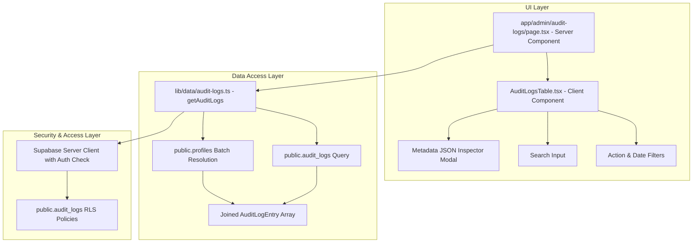

# Architecture Design Specification: Audit Log Viewer

**Document ID**: `DES-03040101`  
**Task ID**: `TASK-03040101` (`SUB-0304010101`, `SUB-0304010102`)  
**Feature**: `FEAT-0304` (Audit Log Viewer)  
**Epic**: `EPIC-03` (Admin HITL Verification Portal & Audit System)  
**Author**: Frontend Engineer & Full-Stack Next.js Architect  
**Status**: Approved  
**Date**: 2026-09-17  

---

## 1. Context & Business Requirements

As government notifications affect thousands of candidates and involve legal commitments, all administrative actions (exam additions, notification publications, verifications, rejections, edits, and deletions) must remain completely accountable. 

The Audit Log Viewer provides super administrators with:
1. Complete chronological visibility over administrative decisions and mutations.
2. Forensic tracking of which administrator performed which action, when, and on what entity.
3. Interactive filtering by action type (`approve_and_publish`, `reject`, `create_notification`, `update_notification`, `delete_notification`, `create_exam`, etc.).
4. Date range filtering and text search across entity IDs and admin identity.
5. In-depth inspection of structured metadata (including before-and-after diffs).

---

## 2. Technical Architecture & Component Flow



---

## 3. Data Contracts & Schema Validation (`lib/schemas/audit-logs.ts`)

```ts
export const AUDIT_ACTIONS = [
  "approve_and_publish",
  "reject",
  "create_exam",
  "update_exam",
  "delete_exam",
  "create_notification",
  "update_notification",
  "delete_notification",
] as const;

export type AuditAction = (typeof AUDIT_ACTIONS)[number];

export const auditLogFilterSchema = z.object({
  search: z.string().trim().max(100).optional().default(""),
  action: z.enum(["all", ...AUDIT_ACTIONS]).optional().default("all"),
  targetEntity: z.string().trim().max(50).optional().default("all"),
  startDate: z.string().regex(/^\d{4}-\d{2}-\d{2}$/).optional(),
  endDate: z.string().regex(/^\d{4}-\d{2}-\d{2}$/).optional(),
  page: z.coerce.number().int().positive().optional().default(1),
  pageSize: z.coerce.number().int().min(10).max(100).optional().default(20),
});
```

---

## 4. Data Access Layer Specification (`lib/data/audit-logs.ts`)

1. **`getAuditLogs(filter)`**:
   - Queries `public.audit_logs` with filters:
     - `action`: equals filter if not `"all"`.
     - `target_entity`: equals filter if not `"all"`.
     - `startDate`: `>= startDate 00:00:00`.
     - `endDate`: `<= endDate 23:59:59`.
     - `search`: filters across `action`, `target_entity`, `target_id`.
   - Ordering: `created_at DESC`.
   - Batch resolves admin profiles: Collects unique `admin_id`s and queries `public.profiles` (`id, full_name, email, avatar_url, role`) in a single indexed query.
   - Maps admin profile data into each log entry.
   - Returns `{ logs, total, page, pageSize, totalPages }`.

---

## 5. UI Architecture & Accessibility
- **`app/admin/audit-logs/page.tsx`**: Server Component loading audit logs based on URL searchParams.
- **`components/admin/AuditLogsTable.tsx`**: Client Component featuring:
  - Action filter pills and dropdown.
  - Date range pickers with quick presets (Today, Past 7 days, Past 30 days, All time).
  - Search input for instant query.
  - Interactive table displaying timestamp, admin badge, action pill, entity type, target ID, and metadata inspector.
  - Metadata Inspector Modal with JSON syntax highlighting and expandable change diffs.
- **Testing Landmarks**:
  - `data-testid="admin-audit-logs-page"`
  - `data-testid="audit-logs-search"`
  - `data-testid="audit-logs-action-filter"`
  - `data-testid="audit-logs-table"`
  - `data-testid="btn-view-metadata-[id]"`
  - `data-testid="audit-metadata-modal"`
