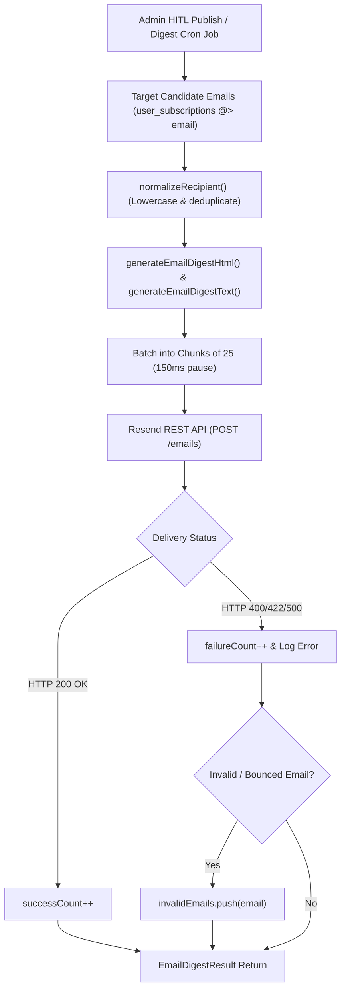

# Email Alert & Digest Dispatch Engine Design & Architecture

**Document ID**: `DESIGN-EMAIL-DISPATCH-001`  
**Task Reference**: `TASK-05040102` (Subtask: `SUB-0504010201`)  
**Scope**: `lib/push/email.ts`, `lib/push/index.ts`  
**Status**: Implemented  
**Date**: September 19, 2026  
**Architecture Reference**: `ADR-004` (Backend), `ADR-007` (Omnichannel Push Alert Engine), `ADR-013` (Security)  

---

## 1. Executive Summary & Objective

The **Email Alert & Digest Dispatch Engine** (`lib/push/email.ts`) provides high-fidelity, accessible, transactional and digest email deliveries for UPA-GURU candidates via the **Resend REST API**.

As documented in `ADR-007`, while instant push notifications (Web Push, Telegram, WhatsApp) target immediate awareness, email serves as the persistent, detailed channel for:
1. **Instant Exam Alerts**: Dedicated transactional alerts sent upon publication of high-priority exams matching candidate category and state filters.
2. **Periodic Exam Digests**: Grouped summaries of recently published notices, deadline countdowns, and upcoming exam schedules.

### Core Capabilities
1. **Responsive, Mobile-First HTML Template Generator (`generateEmailDigestHtml`)**:
   - Engineered using inline styles and table layouts for maximum cross-client compatibility across Gmail (Web & Mobile), Apple Mail, Outlook, and Yahoo Mail.
   - Distinctive typography with UPA-GURU branding header.
   - Structured exam cards highlighting Category badges, Conducting Body, Vacancies count, and critical Application Deadlines in red urgency styling.
   - Prominent Call-to-Action buttons (direct link to `/notification/[slug]`, Apply Online portal).
   - Mandatory CAN-SPAM / GDPR footer with preference management (`/preferences`) and unsubscribe options.
2. **Plaintext Multipart Fallback (`generateEmailDigestText`)**:
   - Generates equivalent plain-text content to ensure accessibility and minimize spam filter penalties.
3. **Throttled Batch Dispatch (`sendEmailDigest`)**:
   - Manages recipient deduplication and executes dispatch in batches of 25 with 150ms intervals, safely complying with Resend API rate limits (~10-20 requests/sec).
   - Isolates delivery failures per recipient so one bad address never breaks the batch.
4. **Development Simulation Mode**:
   - In non-production environments without `RESEND_API_KEY`, logs simulated delivery and returns mock email IDs.

---

## 2. Dispatch Workflow Architecture

---

## 3. Email Template Specifications

### Visual Palette & Structure
* **Header Background**: Dark Slate (`#0f172a`) with white branding and subtitle.
* **Card Container**: White (`#ffffff`) with subtle border (`#e2e8f0`) and rounded corners (8px).
* **Category Pill**: Light Blue (`#eff6ff`) with Royal Blue text (`#1d4ed8`).
* **Deadline Callout**: Deep Red (`#b91c1c`) bold text.
* **Primary Button**: Royal Blue (`#2563eb`) with white text and clean padding.
* **Footer**: Slate (`#f8fafc`) with links to `/preferences` and copyright notice.

---

## 4. Security & Deliverability Safeguards

1. **API Key Isolation**: `RESEND_API_KEY` is loaded strictly on the server with browser-throw guards in `getResendConfig()`.
2. **Deliverability Hygiene**: Always sends both `html` and `text` parts (multipart/alternative), keeping spam score minimal.
3. **Preference Respect**: Only candidates who selected `"email"` in `preferred_channels` are queued for delivery.
4. **Database Acceleration**: GIN index `idx_user_subscriptions_channels` ensures sub-millisecond candidate filtering for `@> ARRAY['email']`.
