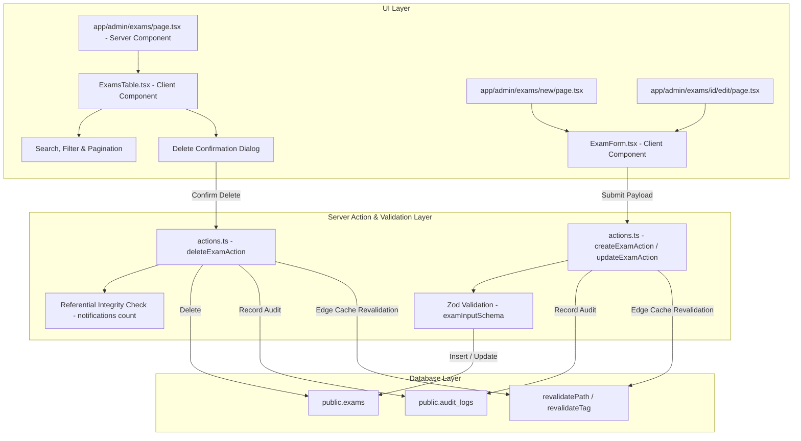

# Architecture Design Specification: Exam Master CRUD Management

**Document ID**: `DES-03030101`  
**Task ID**: `TASK-03030101` (`SUB-0303010101`, `SUB-0303010102`)  
**Feature**: `FEAT-0303` (Exam & Notification CRUD Management)  
**Epic**: `EPIC-03` (Admin HITL Verification Portal & Audit System)  
**Author**: Frontend Engineer & Full-Stack Next.js Architect  
**Status**: Approved  
**Date**: 2026-09-17  

---

## 1. Context & Business Requirements

While the platform's AI Scraper Engine continuously discovers and extracts notifications from government websites, administrative operators require complete manual CRUD (Create, Read, Update, Delete/Archive) capabilities over the master `exams` entity. This ensures:
1. Administrators can register new competitive examination series before public notifications are published.
2. Typos, conducting body reorganizations, or official URL changes can be corrected immediately.
3. Obsolete or mistakenly created exams can be safely deleted or archived while preventing orphaned notifications.
4. All administrative mutations are immutably audited in `public.audit_logs`.

---

## 2. Technical Architecture & Component Flow



---

## 3. Data Contracts & Schema Validation

### 3.1 Zod Input Schema (`lib/schemas/exams.ts`)
```ts
export const examCategoryEnumSchema = z.enum([
  "civil_services",
  "banking",
  "railways",
  "defense",
  "state_psc",
  "teaching",
  "police",
  "other",
]);

export const examInputSchema = z.object({
  title: z
    .string()
    .trim()
    .min(3, "Exam title must be at least 3 characters")
    .max(200, "Exam title cannot exceed 200 characters"),
  slug: z
    .string()
    .trim()
    .toLowerCase()
    .regex(/^[a-z0-9]+(?:-[a-z0-9]+)*$/, "Slug must contain only lowercase alphanumeric characters and hyphens")
    .min(3, "Slug must be at least 3 characters")
    .max(100, "Slug cannot exceed 100 characters"),
  conducting_body: z
    .string()
    .trim()
    .min(2, "Conducting body must be at least 2 characters")
    .max(150, "Conducting body cannot exceed 150 characters"),
  category: examCategoryEnumSchema,
  state_or_central: z
    .string()
    .trim()
    .min(2, "State or Central designation is required")
    .max(100, "Cannot exceed 100 characters"),
  official_website: z
    .string()
    .trim()
    .url("Must be a valid URL (e.g. https://upsc.gov.in)"),
  logo_url: z
    .string()
    .trim()
    .url("Must be a valid URL")
    .or(z.literal(""))
    .nullable()
    .optional(),
});
```

---

## 4. Server Actions Specification (`app/admin/exams/actions.ts`)

1. **`createExamAction(input: ValidatedExamInput)`**:
   - Validates admin session via Supabase Auth (`user.app_metadata.role === 'admin'`).
   - Parses input via `examInputSchema`.
   - Checks slug uniqueness in `public.exams`. If taken, appends deterministic random suffix.
   - Inserts record into `public.exams`.
   - Inserts record into `public.audit_logs`:
     - `action: 'create_exam'`
     - `entity: 'exam'`
     - `entity_id: insertedExam.id`
   - Revalidates paths: `/admin/exams`, `/exams`, `/`.

2. **`updateExamAction(id: string, input: ValidatedExamInput)`**:
   - Validates admin session.
   - Checks slug uniqueness excluding self (`id != currentId`).
   - Updates `public.exams` record.
   - Writes `public.audit_logs`:
     - `action: 'update_exam'`
     - `entity: 'exam'`
     - `entity_id: id`
     - `changes: { before, after }`
   - Revalidates paths: `/admin/exams`, `/admin/exams/[id]/edit`, `/exams`, `/exams/[slug]`.

3. **`deleteExamAction(id: string)`**:
   - Validates admin session.
   - Checks if any notifications reference this exam (`public.notifications.exam_id == id`).
   - If linked notifications exist, blocks deletion with user-friendly error (`"Cannot delete exam with existing notifications"`).
   - If clean, deletes exam from `public.exams`.
   - Writes `public.audit_logs`:
     - `action: 'delete_exam'`
     - `entity: 'exam'`
     - `entity_id: id`
   - Revalidates `/admin/exams`.

---

## 5. UI Architecture & Accessibility
- **`app/admin/exams/page.tsx`**: Next.js Server Component fetching exams data via `getAdminExams()` with search params (`q`, `category`, `page`).
- **`components/admin/ExamsTable.tsx`**: Client Component rendering responsive data table with search input, category filter selector, pagination, and delete confirmation modal.
- **`components/admin/ExamForm.tsx`**: Form component with live title-to-slug transliteration, category selector, validation feedback, and loading states.
- **Testing Landmarks**:
  - `data-testid="admin-exams-page"`
  - `data-testid="admin-exams-search"`
  - `data-testid="admin-exams-table"`
  - `data-testid="btn-create-exam"`
  - `data-testid="btn-edit-exam-[id]"`
  - `data-testid="btn-delete-exam-[id]"`
  - `data-testid="exam-form"`
