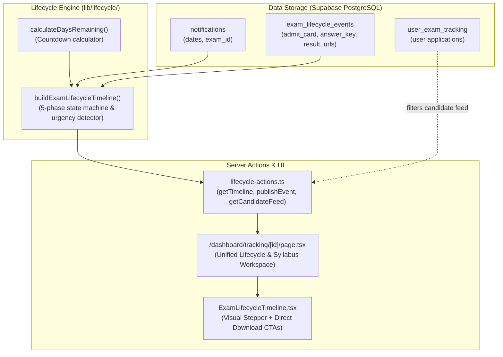

# Architectural Design: Exam Lifecycle Automated Status Tracker

**Enhancement ID:** `ENH-0012`  
**Epic ID:** `EPIC-14`  
**Status:** Completed  
**Owner:** Fullstack Engineer / System Architect  
**Date:** 2026-09-24  
**Architecture Compliance:** Next.js 15 App Router, React Server Components (RSC), Supabase RLS, Zod, Vitest  

---

## 1. Executive Summary & Value Proposition

In the Indian government examination recruitment cycle, the initial job notification is merely step 1 of an extensive 4-to-12 month process. Candidates face significant anxiety and frequently miss critical deadlines across the 4 subsequent lifecycle phases:
1. **Admit Card / Hall Ticket Release**: Narrow 7–14 day window to download the exam hall ticket with reporting time, center location, and photo ID instructions.
2. **Exam Day Conduct & Shifts**: Date announcements, shift timings, and reporting guidelines.
3. **Answer Key & Objection Windows**: High-urgency 3–5 day objection window where candidates can dispute erroneous answer keys.
4. **Results & Merit Lists**: Final marks, cut-offs by reservation category (GM, OBC, SC, ST), and provisional selection lists.

`ENH-0012` bridges the gap between static notification listings and real-time recruitment lifecycle updates, alerting candidates to active milestones and providing direct download links.

---

## 2. Architecture & Data Flow



---

## 3. Database Schema Reference

**Table:** `public.exam_lifecycle_events`

```sql
CREATE TABLE IF NOT EXISTS public.exam_lifecycle_events (
    id UUID PRIMARY KEY DEFAULT gen_random_uuid(),
    notification_id UUID NOT NULL REFERENCES public.notifications(id) ON DELETE CASCADE,
    event_type TEXT NOT NULL CHECK (event_type IN ('admit_card', 'exam_date', 'answer_key', 'objection_window', 'result', 'cutoff_list', 'corrigendum')),
    title TEXT NOT NULL,
    description TEXT,
    official_url TEXT,
    release_date TIMESTAMPTZ NOT NULL DEFAULT NOW(),
    closing_date TIMESTAMPTZ,
    metadata JSONB DEFAULT '{}',
    status TEXT NOT NULL DEFAULT 'published' CHECK (status IN ('draft', 'published', 'archived')),
    created_by UUID REFERENCES auth.users(id),
    created_at TIMESTAMPTZ DEFAULT NOW(),
    updated_at TIMESTAMPTZ DEFAULT NOW()
);
```

### Row Level Security (RLS)
- `SELECT`: `status = 'published' OR (auth.uid() IS NOT NULL AND public.has_permission(auth.uid(), 'notifications:read:all'))`
- `INSERT`, `UPDATE`, `DELETE`: `public.has_permission(auth.uid(), 'notifications:write')`

---

## 4. Multi-Phase Lifecycle State Machine

The timeline engine synthesizes 5 canonical phases:

| Phase | Icon | Active Trigger | Urgency Rule | Action CTA |
|---|---|---|---|---|
| **1. Application Window** | 📄 `FileText` | `now <= application_end_date` | `daysRemaining <= 3` | Apply Online / Official Circular |
| **2. Admit Card** | 💳 `CreditCard` | `admit_card` event published & not passed | `closing_date <= 3 days` | Download Official Hall Ticket |
| **3. Exam Day** | 📅 `Calendar` | `exam_date` is today or within 7 days | `daysRemaining <= 3` | View Exam Center Guidelines |
| **4. Answer Key** | 🔑 `Key` | `answer_key` event published & within objection dates | `objections close in <= 3 days` | Submit Objections / View Key |
| **5. Results** | 🏆 `Award` | `result` event published | Permanent Active | Download Official Merit List PDF |

---

## 5. Verification & Test Suite

Automated test suite validates logic and security policies:
- `tests/unit/exam-lifecycle.test.ts` (11 tests)
  - `calculateDaysRemaining` boundary conditions (past, present, future, nulls)
  - `buildExamLifecycleTimeline` phase resolution and urgency detection
  - `createLifecycleEventSchema` input validation and sanitization
- Overall system suite: **185 tests passing across 16 test files**.
