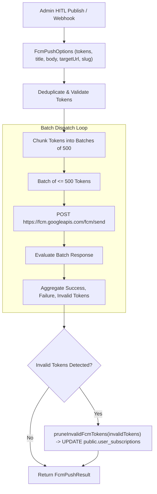

# FCM Web Push Dispatch Engine Design & Architecture

**Document ID**: `DESIGN-FCM-DISPATCH-001`  
**Task Reference**: `TASK-05020102` (Subtask: `SUB-0502010201`)  
**Scope**: `lib/push/fcm.ts`, `lib/push/index.ts`  
**Status**: Implemented  
**Date**: September 19, 2026  
**Architecture Reference**: `ADR-004` (Backend), `ADR-007` (Omnichannel Push Alert Engine), `ADR-013` (Security)

---

## 1. Executive Summary & Objective

The **FCM Push Dispatch Engine** (`lib/push/fcm.ts`) is the server-side multicast distribution service responsible for broadcasting real-time exam notifications to thousands of candidate devices.

### Core Capabilities
1. **Multicast Batch Chunking**: Automatically divides large subscriber arrays into chunks of 500 (the maximum batch limit supported by Google FCM protocol) to maximize network throughput and avoid request timeout errors.
2. **Automated Stale Token Pruning**: Identifies deactivated, expired, or uninstalled device tokens (`NotRegistered`, `InvalidRegistration`, `MismatchSenderId`) returned by the Google FCM gateway and automatically sets `fcm_device_token = NULL` in `public.user_subscriptions`.
3. **Isolated Failure Containment**: Per-token and per-batch failures are captured without aborting the parent notification publishing workflow.
4. **Resilient Fallback Mode**: Gracefully simulates deliveries with diagnostic warnings when running locally without `FIREBASE_SERVER_KEY`, unblocking developer workflows.

---

## 2. Dispatch Workflow Architecture



---

## 3. Function Interface & Options Contract

```typescript
export interface FcmPushOptions {
  tokens: string[];
  title: string;
  body: string;
  targetUrl?: string;
  notificationId?: string;
  slug?: string;
  category?: string;
  icon?: string;
  badge?: string;
  image?: string;
}

export interface FcmPushResult {
  success: boolean;
  totalTokens: number;
  successCount: number;
  failureCount: number;
  invalidTokens: string[];
  errors: Array<{ token: string; error: string }>;
  durationMs: number;
}
```

---

## 4. Stale Token Pruning (`pruneInvalidFcmTokens`)

To prevent ongoing notification delivery degradation and reduce database index bloat:
```typescript
await supabaseAdmin
  .table("user_subscriptions")
  .update({ fcm_device_token: null, updated_at: new Date().toISOString() })
  .in("fcm_device_token", invalidTokens);
```

---

## 5. Security & Isolation Guardrails
- **Service Role Isolation**: Token pruning uses `createAdminClient()` strictly on the server; the service role key is never accessible to client bundles.
- **Server Key Privacy**: `FIREBASE_SERVER_KEY` is loaded strictly in server-side functions.
- **Transactional Independence**: FCM communication is asynchronous and non-blocking, ensuring database publish events remain resilient even if third-party Google gateways experience downtime.
