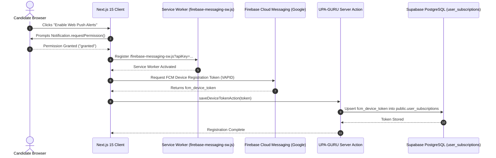

# Firebase Cloud Messaging (FCM) Web Push & Service Worker Design

**Document ID**: `DESIGN-FCM-PUSH-001`  
**Task Reference**: `TASK-05020101` (Subtasks: `SUB-0502010101`, `SUB-0502010102`)  
**Scope**: `public/firebase-messaging-sw.js`, `lib/push/firebase-config.ts`, `lib/push/client-token.ts`  
**Status**: Implemented  
**Date**: September 19, 2026  
**Architecture Reference**: `ADR-001` (Frontend RSC), `ADR-002` (Database), `ADR-007` (Omnichannel Push Alert Engine), `ADR-013` (Security)

---

## 1. Executive Summary & Objective

The **FCM Web Push & Service Worker** subsystem provides browser-native, real-time background notification capabilities for UPA-GURU candidates. It enables immediate delivery of critical exam notices, application deadlines, and admit card releases directly to desktop and mobile browsers, even when the user is not actively browsing the website.

### Core Tenets
1. **Background Receipt & Native Display**: Operates independently of the browser window state via a dedicated Service Worker (`public/firebase-messaging-sw.js`).
2. **Deep-Link Navigation**: Notification clicks dynamically route to the exact notification page (`/notification/[slug]`) or refocus existing application tabs.
3. **Zero Secrets in Client**: Public Firebase parameters (`apiKey`, `projectId`, `appId`, `messagingSenderId`) are safely separated from server-only keys (`FIREBASE_SERVER_KEY`).
4. **Actionable Notification UI**: Notifications include interactive action buttons ("View Exam Details" and "Dismiss") with distinct vibration patterns and badges.

---

## 2. Architecture & Data Flow



---

## 3. Service Worker Implementation Details

- **Location**: `public/firebase-messaging-sw.js` (served at `/firebase-messaging-sw.js` with root scope `/`).
- **Imports**: Google Firebase Compat SDK v10.13.0 (`firebase-app-compat.js`, `firebase-messaging-compat.js`).
- **Query Parameter Resolution**: Dynamic propagation of client parameters on registration allows project credential updates without modifying static service worker files.
- **Background Listener**: `messaging.onBackgroundMessage` handles structured push payloads.
- **Deep-Link Window Matching**: `clients.matchAll({ type: 'window' })` prevents opening duplicate tabs if UPA-GURU is already open.

---

## 4. Database Schema & Migration

### Target Column: `public.user_subscriptions.fcm_device_token`
```sql
-- Migration Script: .agents/knowledge/database/fcm-web-push-schema-v1.sql
CREATE INDEX IF NOT EXISTS idx_user_subscriptions_fcm 
    ON public.user_subscriptions (fcm_device_token) 
    WHERE fcm_device_token IS NOT NULL;
```

---

## 5. Security & Verification Guardrails
- **Origin Isolation**: Service Worker is strictly bound to the UPA-GURU application origin.
- **Session-Guarded Token Persistence**: `saveDeviceTokenAction` in `lib/push/actions.ts` verifies `supabase.auth.getUser()`, eliminating unauthenticated token hijacking.
- **OWASP Compliance**: No private API keys or service role credentials are included in the Service Worker.
