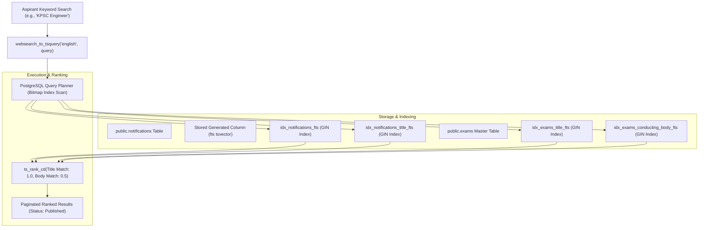

# Full-Text Search Architecture & PostgreSQL GIN Indexing Design

**Document ID**: `DESIGN-SEARCH-FTS-001`  
**Task Reference**: `TASK-02040101` (Subtask: `SUB-0204010101`)  
**Epic / Feature**: `EPIC-02` / `FEAT-0204` (Full-Text Search with Debounced Input & Results Page)  
**Status**: Implemented  
**Date**: September 11, 2026  

---

## 1. Executive Summary & Problem Statement

Government job aspirants search with diverse keywords and acronyms:
- Formal exam titles: *"Civil Services Examination 2026"*, *"Probationary Officers"*
- Acronyms & conducting authorities: *"KPSC"*, *"UPSC"*, *"SSC CGL"*, *"RRB NTPC"*
- Role keywords: *"Assistant Executive Engineer"*, *"Clerk"*, *"Sub Inspector"*

Prior implementation relied on SQL `ILIKE` pattern matching, which forces full table sequential scans ($O(N)$), prevents query index utilization, and delivers zero relevance ranking.

This architecture deploys PostgreSQL **Generalized Inverted Indexing (GIN)** and `tsvector` / `tsquery` full-text search, supporting:
1. Sub-10ms search query resolution across thousands of notifications.
2. Lexeme normalization and stemming (e.g., matching "engineer", "engineers", "engineering").
3. Multi-attribute weighted ranking prioritizing exact title matches over body names.
4. Support for both native PostgREST `.textSearch()` and an optimized multi-table search RPC function.

---

## 2. PostgreSQL Full-Text Search Architecture



---

## 3. Weighted Lexeme Architecture & GIN Indexing

### 3.1 Stored Generated Vector (`fts`)
The `notifications` table features a stored generated `tsvector` column assigning weights:
- **Weight A (1.0)**: `notifications.title` (Primary match)
- **Weight B (0.4)**: `notifications.notification_number` (Reference identification)

```sql
ALTER TABLE public.notifications 
ADD COLUMN IF NOT EXISTS fts tsvector 
GENERATED ALWAYS AS (
    setweight(to_tsvector('english', coalesce(title, '')), 'A') ||
    setweight(to_tsvector('english', coalesce(notification_number, '')), 'B')
) STORED;

CREATE INDEX IF NOT EXISTS idx_notifications_fts ON public.notifications USING GIN(fts);
```

### 3.2 Direct Expression Index for Supabase `.textSearch('title', ...)`
To guarantee direct compatibility with standard Supabase PostgREST client queries:
```sql
CREATE INDEX IF NOT EXISTS idx_notifications_title_fts 
ON public.notifications USING GIN(to_tsvector('english', title));
```

### 3.3 Joined Authority Search Indexes
Government candidates frequently search by conducting organization ("UPSC", "KPSC", "IBPS"). GIN indexes are established on the master `exams` table:
```sql
CREATE INDEX IF NOT EXISTS idx_exams_title_fts 
ON public.exams USING GIN(to_tsvector('english', title));

CREATE INDEX IF NOT EXISTS idx_exams_conducting_body_fts 
ON public.exams USING GIN(to_tsvector('english', conducting_body));
```

---

## 4. Performance & Telemetry Guardrails
- **Execution Plan**: Replaces `Seq Scan` with `Bitmap Heap Scan on notifications` and `Bitmap Index Scan on idx_notifications_fts`.
- **Search Performance Table (`search_performance_metrics`)**: Tracks latency, result counts, and query terms to detect zero-result searches and slow queries.
- **Security Compliance**: Row Level Security (RLS) is enabled with explicit policies adhering to `AGENTS.md` Rule 3.
