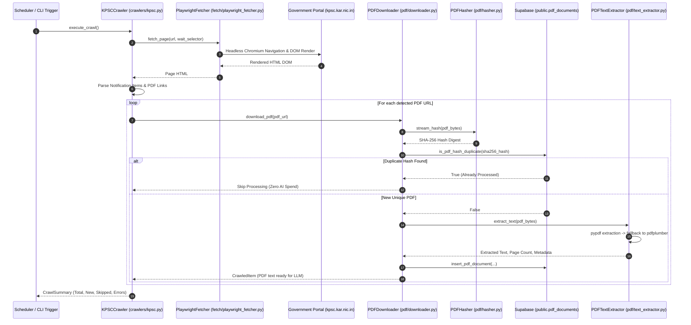

# KPSC Crawler & PDF Pipeline Architecture Design

## Document Metadata
* **Task ID**: `TASK-04010102`
* **Subtasks**: `SUB-0401010201`, `SUB-0401010202`
* **Epic / Feature**: `EPIC-04` / `FEAT-0401`
* **Architectural Decisions**: `ADR-004-Background-Workers.md`, `ADR-013-Security.md`, `ADR-015-AI-Integration.md`
* **Target Audience**: Backend Engineers, Scraper Developers

---

## 1. Executive Summary & Component Workflow

`TASK-04010102` establishes the crawler framework and the first portal implementation: the **Karnataka Public Service Commission (KPSC)** crawler alongside the end-to-end PDF downloading, SHA-256 deduplication hashing, and dual-engine text extraction pipeline.



---

## 2. Invariants & Safety Guardrails

1. **Deterministic Deduplication Before AI Spend**: The SHA-256 hash is computed in streaming memory immediately upon downloading. If the hash matches an existing record in `public.pdf_documents`, the pipeline halts for that document, incurring zero Gemini API costs.
2. **Dual-Engine PDF Parsing**: Primary text extraction is handled by `pypdf` for raw speed. If the text yield is low (< 100 characters per page or tabular layout detected), it falls back to `pdfplumber` to extract structured tables.
3. **Bandwidth & Memory Protection**:
   - Downloads enforce a maximum ceiling of `PDF_MAX_DOWNLOAD_SIZE_MB` (default 25MB) via HTTP `Content-Length` headers and streaming byte counters.
   - HTTP requests enforce a timeout of `PDF_DOWNLOAD_TIMEOUT_SECONDS` (default 45s).
4. **Stealth & Anti-Bot Resilience**: Playwright Chromium runs with realistic User-Agent headers, standard desktop viewports (1920x1080), disabled webdriver flags, and random micro-jitter delays to avoid aggressive IP throttling by government NIC servers.
5. **Declarative Portal Definitions**: Selectors and URLs are defined in YAML (`config/portals/kpsc.yaml`), separating DOM query selectors from Python execution code.

---

## 3. Directory Layout & Module Responsibilities

```
scraper/
├── config/
│   └── portals/
│       └── kpsc.yaml               # Declarative KPSC URLs, selectors, and engine config
├── fetch/
│   ├── base.py                     # BaseFetcher abstract class
│   ├── httpx_fetcher.py            # Async HTTPX client for static pages & PDFs
│   └── playwright_fetcher.py       # Headless Chromium for JS-rendered portals
├── crawlers/
│   ├── base.py                     # BaseCrawler lifecycle & data models
│   ├── portal_loader.py            # YAML configuration parser
│   └── kpsc.py                     # KPSC crawler implementation
└── pdf/
    ├── hasher.py                   # Streaming SHA-256 hash calculation
    ├── downloader.py               # Size-limited streaming PDF downloader
    └── text_extractor.py           # Dual-engine pypdf + pdfplumber text parser
```
