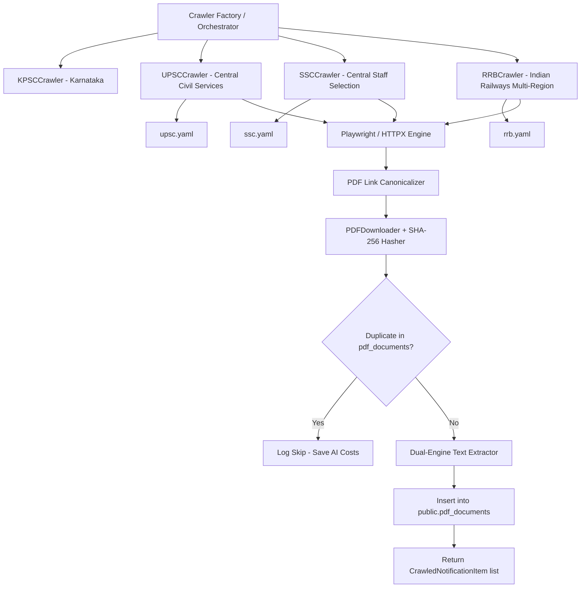

# Multi-Portal Crawlers Architecture Design (UPSC, SSC, RRB)

## Document Metadata
* **Task ID**: `TASK-04010103`
* **Subtasks**: `SUB-0401010301`, `SUB-0401010302`, `SUB-0401010303`
* **Epic / Feature**: `EPIC-04` / `FEAT-0401`
* **Architectural Decisions**: `ADR-004-Background-Workers.md`, `ADR-013-Security.md`, `ADR-015-AI-Integration.md`
* **Target Audience**: Backend Engineers, Crawler Specialists

---

## 1. Executive Summary

`TASK-04010103` expands the crawler infrastructure established in `TASK-04010102` to encompass India's premier central government recruitment boards:
1. **UPSC (Union Public Service Commission)**: Central Civil Services, Engineering, Defense, and Medical examinations (`upsc.gov.in`).
2. **SSC (Staff Selection Commission)**: Combined Graduate Level (CGL), CHSL, MTS, and Central Police Organization notices (`ssc.gov.in` / `ssc.nic.in`).
3. **RRB (Railway Recruitment Boards)**: Multi-regional railway recruitment portals (Non-Technical Popular Categories [NTPC], Assistant Loco Pilot [ALP], Group D).

All crawlers adhere strictly to the `BaseCrawler` contract, leveraging declarative YAML specifications, streaming PDF downloading with in-flight SHA-256 deduplication, and dual-engine text extraction.



---

## 2. Portal-Specific Extraction Nuances

| Portal | URL & Architecture | DOM Quirks & Selectors | Key Filters |
| :--- | :--- | :--- | :--- |
| **UPSC** | `https://upsc.gov.in/examinations/active-examinations` | Tables with nested links inside accordion and tab structures. Requires waiting for dynamic content hydration. | "Notification", "Examination", "Advt". Excludes interview schedules and final results. |
| **SSC** | `https://ssc.gov.in/` & notices tab | Dynamic React/Angular SPA hydration with paginated table views. PDF downloads frequently use relative paths with encoded characters. | "Notice of Examination", "Recruitment", "Phase-". Excludes exam day guidelines and tentative answer keys. |
| **RRB** | Multi-regional (e.g. `rrbbnc.gov.in`, `rrbcdg.gov.in`) | Legacy HTML tables with Centralized Employment Notices (CEN). PDF links formatted as CEN 01/2024, CEN 02/2024. | "CEN", "Recruitment", "Notification", "Employment". Excludes medical appeals. |

---

## 3. Directory Layout & Module Responsibilities

```
scraper/
├── config/
│   └── portals/
│       ├── kpsc.yaml               # KPSC declarative definition (Existing)
│       ├── upsc.yaml               # UPSC active examinations definition
│       ├── ssc.yaml                # SSC notices definition
│       └── rrb.yaml                # RRB Central & Regional definition
└── crawlers/
    ├── base.py                     # BaseCrawler abstraction (Existing)
    ├── portal_loader.py            # YAML configuration loader (Existing)
    ├── kpsc.py                     # KPSC crawler (Existing)
    ├── upsc.py                     # UPSC crawler implementation (SUB-0401010301)
    ├── ssc.py                      # SSC crawler implementation (SUB-0401010302)
    └── rrb.py                      # RRB crawler implementation (SUB-0401010303)
```
