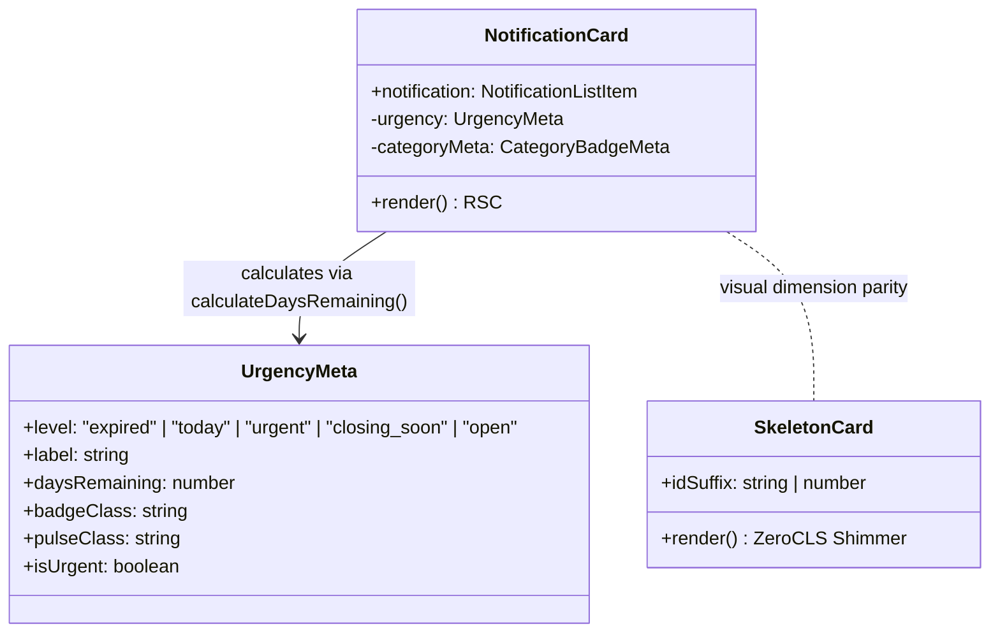

# System Design: NotificationCard & SkeletonCard Components

## 1. Overview & Context
- **Task ID**: `TASK-02020102` (Subtasks: `SUB-0202010201`, `SUB-0202010202`)
- **Epic**: `EPIC-02` (Candidate Portal: Notification Feed, Detail Pages & Search)
- **Feature**: `FEAT-0202` (Homepage Notification Feed with Filters & Pagination)
- **User Story**: `STORY-020201` (Candidate browsing exam notifications with filters)
- **Target Files**:
  - `components/notifications/NotificationCard.tsx` (RSC Card)
  - `components/notifications/SkeletonCard.tsx` (Suspense Shimmer Fallback)
  - `components/notifications/index.ts` (Barrel Export)
  - `lib/utils.ts` (Countdown & Urgency Helpers)

---

## 2. Component Structure & Data Layout

---

## 3. Deadline Countdown & Urgency Rules

The deadline countdown is evaluated based on calendar days between the target date and current local date:

| Condition | Urgency Level | Visual Treatment | Animation |
|---|---|---|---|
| $\text{diffDays} < 0$ | `expired` | `bg-surface-elevated text-text-muted` | None (greyed out) |
| $\text{diffDays} = 0$ | `today` | `bg-danger/10 text-danger border-danger/30` | `animate-pulse` + ping indicator |
| $1 \le \text{diffDays} \le 5$ | `urgent` | `bg-danger/10 text-danger border-danger/30` | `animate-pulse` + ping indicator |
| $6 \le \text{diffDays} \le 15$| `closing_soon` | `bg-warning/10 text-warning border-warning/30` | Static amber warning |
| $\text{diffDays} > 15$ | `open` | `bg-success/10 text-success border-success/30` | Static green open badge |

---

## 4. Zero Cumulative Layout Shift (CLS) Architecture
`SkeletonCard.tsx` mirrors the structural layout of `NotificationCard.tsx` with identical:
- Container padding (`p-5`)
- Border radius (`rounded-xl`)
- Header meta bar height and margin
- Title clamp height (2-line heading reservation)
- Key metrics container dimensions (`grid-cols-2`, `py-2.5 px-3`)
- Footer deadline badge reservation

When streamed via React 15 Suspense, the placeholder renders identically to the resolved card, achieving **CLS = 0** in Google Lighthouse audits.
