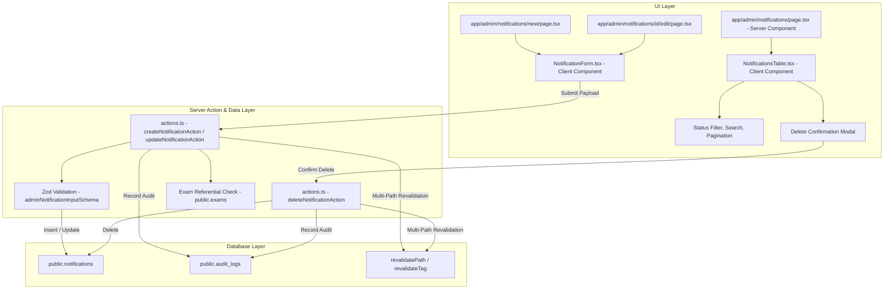

# Architecture Design Specification: Notification CRUD Management

**Document ID**: `DES-03030102`  
**Task ID**: `TASK-03030102` (`SUB-0303010201`)  
**Feature**: `FEAT-0303` (Exam & Notification CRUD Management)  
**Epic**: `EPIC-03` (Admin HITL Verification Portal & Audit System)  
**Author**: Frontend Engineer & Full-Stack Next.js Architect  
**Status**: Approved  
**Date**: 2026-09-17  

---

## 1. Context & Business Requirements

While the AI ingestion pipeline processes government notifications automatically into `public.draft_notifications`, operators need direct manual CRUD capabilities over `public.notifications` to:
1. Manually author urgent or un-scraped government job openings directly.
2. Edit or amend active published notifications (e.g. extending application deadlines, updating vacancy tallies, or correcting portal links).
3. Change notification lifecycle states (`draft` -> `under_review` -> `published` -> `archived`).
4. Safely delete mistakenly created notifications with complete audit logging.
5. Accurately link every notification to an existing master `exam` entity.

---

## 2. Technical Architecture & Component Flow



---

## 3. Data Contracts & Schema Validation (`lib/schemas/admin-notifications.ts`)

```ts
export const adminNotificationInputSchema = z.object({
  exam_id: z.string().uuid("Please select a valid parent examination"),
  title: z
    .string()
    .trim()
    .min(5, "Title must be at least 5 characters")
    .max(255, "Title cannot exceed 255 characters"),
  slug: z
    .string()
    .trim()
    .toLowerCase()
    .min(3, "Slug must be at least 3 characters")
    .max(120, "Slug cannot exceed 120 characters")
    .regex(/^[a-z0-9]+(?:-[a-z0-9]+)*$/, "Slug must contain only lowercase alphanumeric characters and hyphens"),
  notification_number: z.string().trim().max(100).nullable().optional(),
  total_vacancies: z.coerce
    .number()
    .int("Vacancies must be an integer")
    .min(0, "Vacancies cannot be negative")
    .default(0),
  application_start_date: z
    .string()
    .trim()
    .regex(/^\d{4}-\d{2}-\d{2}$/, "Must be in YYYY-MM-DD format"),
  application_end_date: z
    .string()
    .trim()
    .regex(/^\d{4}-\d{2}-\d{2}$/, "Must be in YYYY-MM-DD format"),
  exam_date: z
    .string()
    .trim()
    .regex(/^\d{4}-\d{2}-\d{2}$/, "Must be in YYYY-MM-DD format")
    .nullable()
    .optional()
    .or(z.literal("")),
  qualification_required: z
    .array(z.string())
    .or(
      z.string().transform((val) =>
        val
          .split("\n")
          .map((s) => s.trim())
          .filter(Boolean)
      )
    ),
  age_limit_min: z.coerce.number().int().min(0).max(100).nullable().optional(),
  age_limit_max: z.coerce.number().int().min(0).max(100).nullable().optional(),
  official_pdf_url: z
    .string()
    .trim()
    .url("Must be a valid URL")
    .or(z.literal(""))
    .nullable()
    .optional(),
  apply_online_url: z
    .string()
    .trim()
    .url("Must be a valid URL")
    .or(z.literal(""))
    .nullable()
    .optional(),
  status: z.enum(["draft", "under_review", "published", "archived"]).default("published"),
});
```

---

## 4. Server Actions Specification (`app/admin/notifications/actions.ts`)

1. **`createNotificationAction(rawInput)`**:
   - RBAC check: Requires `user.app_metadata.role === 'admin'`.
   - Validates payload using `adminNotificationInputSchema`.
   - Confirms `exam_id` exists in `public.exams`.
   - Verifies `slug` uniqueness. If taken, attaches a unique random suffix.
   - Sets `verified_by: user.id` and `published_at: new Date().toISOString()` if status is `'published'`.
   - Inserts record into `public.notifications`.
   - Inserts record into `public.audit_logs`:
     - `action: 'create_notification'`
     - `target_entity: 'notification'`
     - `target_id: inserted.id`
   - Revalidates paths: `/admin/notifications`, `/notifications`, `/notification/[slug]`, `/`, and tag `notifications`.

2. **`updateNotificationAction(id, rawInput)`**:
   - RBAC check.
   - Validates payload.
   - Verifies `slug` uniqueness excluding self.
   - Fetches current record to generate audit diff (`before` vs `after`).
   - If transitioning to `'published'` for the first time, sets `verified_by` and `published_at`.
   - Updates record in `public.notifications`.
   - Records audit entry in `public.audit_logs`.
   - Multi-path cache revalidation.

3. **`deleteNotificationAction(id)`**:
   - RBAC check.
   - Fetches target notification record for audit trail.
   - Deletes record from `public.notifications`.
   - Records audit entry in `public.audit_logs`:
     - `action: 'delete_notification'`
     - `target_entity: 'notification'`
     - `target_id: id`
   - Revalidates cache paths.

---

## 5. UI Architecture & Accessibility
- **`app/admin/notifications/page.tsx`**: Server Component displaying paginated notification records with title, parent exam commission, vacancy badge, deadline status, publication lifecycle badge, and edit actions.
- **`components/admin/NotificationsTable.tsx`**: Client Component supporting status tabs (`all`, `published`, `draft`, `under_review`, `archived`), search input, and delete modal.
- **`components/admin/NotificationForm.tsx`**: Client Component featuring:
  - Parent exam selection dropdown pre-populated with active exams.
  - Live title-to-slug auto-generation with manual override.
  - Vacancy and age limit inputs.
  - Date pickers for application opening, deadline, and examination date.
  - Multi-line qualification criteria textarea.
  - Official PDF and application portal URLs.
  - Lifecycle status selector.
- **Testing Landmarks**:
  - `data-testid="admin-notifications-page"`
  - `data-testid="admin-notifications-search"`
  - `data-testid="admin-notifications-table"`
  - `data-testid="btn-create-notification"`
  - `data-testid="btn-edit-notification-[id]"`
  - `data-testid="notification-form"`
  - `data-testid="field-exam-id"`
