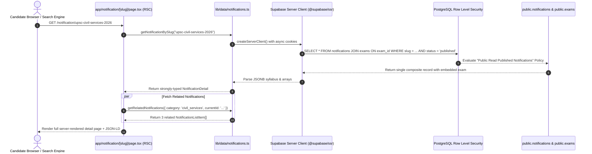

# System Design: Notification Detail Data Access Layer (`getNotificationBySlug`)

## 1. Overview & Context
- **Task ID**: `TASK-02030101` (Subtask: `SUB-0203010101`)
- **Epic**: `EPIC-02` (Candidate Portal: Notification Feed, Detail Pages & Search)
- **Feature**: `FEAT-0203` (Notification Detail Page with JSON-LD & PDF Download)
- **User Story**: `STORY-020301` (Complete exam notification details view)
- **Target Files**:
  - `lib/data/notifications.ts` (`getNotificationBySlug`, `getRelatedNotifications`, `getAllPublishedNotificationSlugs`)
  - `types/notifications.ts` (`NotificationDetail`, `ExamSummary`)

---

## 2. Architectural Data Flow & Detail Lookup Sequence

---

## 3. Data Integrity & Security Guardrails
1. **Status Enforcement**: The query builder strictly checks `.eq("status", "published")`, ensuring draft, under review, or archived notifications are never exposed through guessed slugs.
2. **Nullable Slug Protection**: Immediate short-circuit evaluation returns `null` if the provided slug is empty or whitespace.
3. **Structured Syllabus Parsing**: The `syllabus_summary` JSONB column is safely mapped to `Record<string, unknown>`, accommodating arbitrary paper, stage, and syllabus structures without loose `any` types.
4. **Pre-Rendering Support**: `getAllPublishedNotificationSlugs()` enables Next.js App Router `generateStaticParams()` to pre-render the top published notifications at build time for instant CDN delivery.
