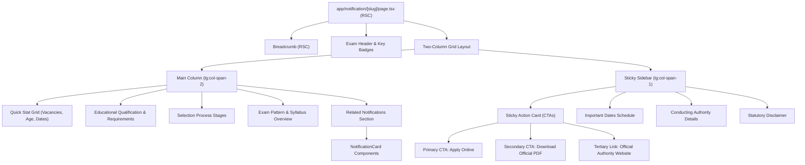

# Notification Detail Page Design & Architecture

**Document ID**: `DESIGN-NOTIF-DETAIL-001`  
**Task Reference**: `TASK-02030102` (Subtasks: `SUB-0203010201`, `SUB-0203010202`, `SUB-0203010203`)  
**Route**: `/notification/[slug]` (`app/notification/[slug]/page.tsx`)  
**Status**: Implemented  
**Date**: September 11, 2026  

---

## 1. Executive Summary & Objective

The Notification Detail Page is the primary informational and conversion hub for candidates within the UpaGuru portal. It delivers complete, authoritative, and structured government job notification intelligence—extracting key deadlines, vacancy breakdowns, age limits, educational qualifications, selection stages, syllabus breakdowns, and official portal links into a high-performance, mobile-first interface.

### Architectural Tenets
1. **0KB Client Hydration Overhead**: Implemented as a pure React Server Component (RSC), delivering zero runtime JavaScript for detail rendering and ensuring near-instant Time to First Byte (TTFB) and sub-1.0s First Contentful Paint (FCP).
2. **Next.js 15 Compatibility**: Conforms to Next.js 15 async route parameters contract (`await params`).
3. **Graceful Degradation & Fallbacks**: Government notifications occasionally lag in issuing live application portals or notification PDFs. Action buttons feature explicit disabled states with contextual explanations rather than broken outbound links or hidden CTAs.
4. **Contextual Discovery**: Includes a dedicated Related Notifications section querying the same examination category with reciprocal exclusion of the current record.

---

## 2. Component Hierarchy & Layout Specifications

---

## 3. Subtask Implementation Details

### SUB-0203010201: Structured Detail Layout
- **Route Handler**: `app/notification/[slug]/page.tsx`
- **Error Handling**: Invokes `notFound()` when `getNotificationBySlug(slug)` returns `null`, rendering `app/notification/[slug]/not-found.tsx` with recovery navigation.
- **Static Generation (`generateStaticParams`)**: Pre-renders the top 100 most critical government notification slugs ahead of time, serving them directly from cache with Incremental Static Regeneration (ISR).
- **Responsive Layout**:
  - Mobile (<1024px): Single column flow with action CTAs at the top and bottom.
  - Desktop (≥1024px): Two-column asymmetric grid (`grid-cols-1 lg:grid-cols-3`) with a sticky desktop sidebar (`lg:sticky lg:top-8`).
- **Structured Content Blocks**:
  - Summary Metrics: Total Vacancies (with category breakdown), Age Limit, Application Window, Urgency Countdown.
  - Qualification & Eligibility: Degree requirements, minimum percentage, age relaxation rules.
  - Selection Process: Step-by-step examination stages (e.g., Preliminary Exam, Mains Exam, Interview, Document Verification).
  - Syllabus & Exam Pattern: Subject lists, marks distribution, duration, and marking schemes.

### SUB-0203010202: High-Visibility CTAs with Fallbacks
- **Primary CTA ("Apply Online")**:
  - Active State: Direct external link with `target="_blank" rel="noopener noreferrer"` and distinct primary gradient accent.
  - Inactive State: Disabled button with lock icon indicating `Application Link Awaited` and subtitle `Portal opens on [Start Date]`.
- **Secondary CTA ("Download Official PDF")**:
  - Active State: High-contrast outline button pointing to verified government PDF asset.
  - Inactive State: Disabled button with helper text `Official PDF Awaited`.
- **Tertiary Link**: Direct verified link to conducting authority's official domain (`exam.conductingBodyWebsite`).

### SUB-0203010203: Related Notifications Discovery
- Uses `getRelatedNotifications({ category, currentSlug, limit: 3 })`.
- Renders lightweight `<NotificationCard>` components configured with urgency highlights.
- Prevents dead ends for candidates seeking alternatives in the same domain (e.g., SSC, Banking, Railways).

---

## 4. Accessibility & Playwright Automation Landmarks

All interactive elements and content containers feature rigorous ARIA labels and `data-testid` landmarks:
| Landmark / Test ID | Component / Element | Purpose |
| :--- | :--- | :--- |
| `notification-detail-page` | `<main>` container | Identifies the root page element |
| `breadcrumb-nav` | `<nav>` | Accessible breadcrumb landmark |
| `detail-apply-online-btn` | `<a>` or `<button>` | Target for Apply Online click testing |
| `detail-download-pdf-btn` | `<a>` or `<button>` | Target for PDF download testing |
| `detail-authority-link` | `<a>` | Target for authority website testing |
| `related-notifications-section` | `<section>` | Container for related exam cards |
| `related-notification-card` | `<article>` | Individual related card assertion |

---

## 5. Security & Outbound Link Hardening
- Every outbound anchor (`applyOnlineUrl`, `officialPdfUrl`, `conductingBodyWebsite`) includes mandatory `rel="noopener noreferrer"`.
- Content sanitization: Server-rendered string interpolation prevents XSS injection vectors.
- Audit logging readiness: DB schema provided for tracking candidate conversion clicks via `candidate_outbound_clicks`.
