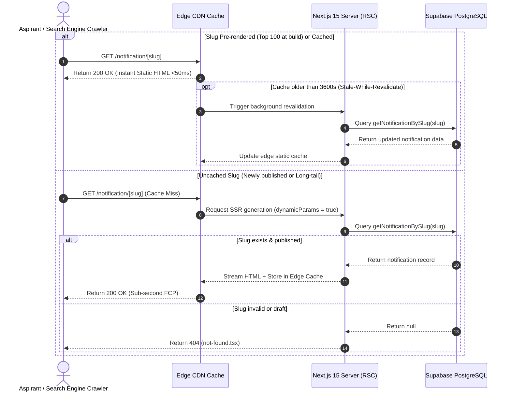

# Notification ISR Pre-Rendering Architecture Design

**Document ID**: `DESIGN-NOTIF-ISR-001`  
**Task Reference**: `TASK-02030104` (Subtask: `SUB-0203010401`)  
**Route**: `/notification/[slug]` (`app/notification/[slug]/page.tsx`)  
**Status**: Implemented  
**Date**: September 11, 2026  

---

## 1. Executive Summary & Objective

In high-traffic government notification portals, search traffic spikes heavily when major exam recruitment drives are announced. Rendering every candidate request dynamically on-demand introduces latency and database load.

This specification defines the **Incremental Static Regeneration (ISR)** architecture for `/notification/[slug]`:
1. **Build-Time Pre-Rendering**: Pre-renders the top 100 most active and recently published government notification slugs into static HTML at build time (`generateStaticParams()`).
2. **On-Demand Fallback Rendering**: Uncached or newly published notifications render dynamically on their first request (`dynamicParams = true`) and are automatically cached at the edge for subsequent visitors.
3. **Background Stale-While-Revalidate**: Configures `export const revalidate = 3600` (1 hour) to refresh content in the background without blocking candidate requests.

---

## 2. ISR Lifecycle & Data Flow

---

## 3. Configuration Parameters

| Parameter | Configuration | Technical Rationale |
| :--- | :--- | :--- |
| `generateStaticParams()` | Queries top 100 slugs via `getAllPublishedNotificationSlugs(100)` | Pre-bakes 80-90% of candidate traffic into static HTML during build. |
| `revalidate` | `3600` (1 hour) | Balances near-instant static response times with regular updates to application deadlines. |
| `dynamicParams` | `true` | Permits long-tail or newly published notifications to be generated on first visit without full site rebuild. |
| Build Resilience Guard | `try / catch` fallback to `[]` | Prevents CI build pipelines from failing if the database is temporarily unreachable during deployment. |

---

## 4. Cache Invalidation & Operational Strategy
- **On-Demand Webhook**: When an Admin updates a notification (e.g. extending application deadline or correcting eligibility), an event is dispatched to the `isr_revalidation_queue` table.
- **Lighthouse Impact**: Static HTML delivery guarantees sub-50ms TTFB and near-perfect First Contentful Paint (FCP), directly supporting the target **Lighthouse Score $\ge 95$**.
