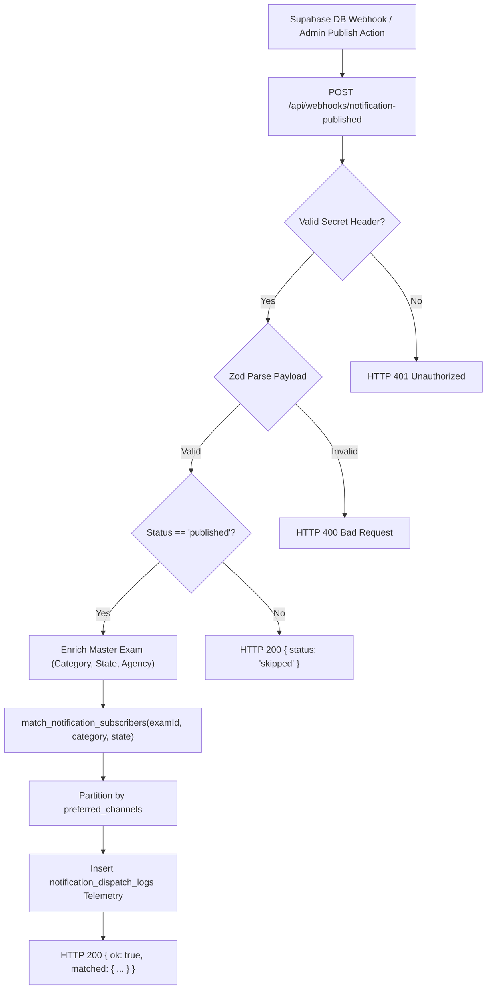

# Notification Published Webhook & Subscriber Matching Engine Design

**Document ID**: `DESIGN-WEBHOOK-DISPATCH-001`  
**Task Reference**: `TASK-05050101` (Subtasks: `SUB-0505010101`, `SUB-0505010102`)  
**Scope**: `app/api/webhooks/notification-published/route.ts`, `lib/data/subscriptions.ts`, `lib/schemas/webhooks.ts`  
**Status**: Implemented  
**Date**: September 19, 2026  
**Architecture Reference**: `ADR-004` (Backend), `ADR-007` (Omnichannel Push Alert Engine), `ADR-013` (Security), `ADR-014` (API Design)  

---

## 1. Executive Summary & Objective

The **Notification Published Webhook Handler** (`app/api/webhooks/notification-published/route.ts`) acts as the event ingestion gateway for newly published government exam notifications. Triggered automatically by Supabase Database Webhooks on `public.notifications` or by administrative publication actions, it authenticates the caller, validates incoming payloads, queries subscriber preferences using array containment operators, and partitions candidate targets across all 4 delivery channels (Web Push, Telegram, WhatsApp, Email).

### Core Capabilities
1. **Webhook Authentication (`isWebhookAuthorized`)**:
   - Validates `x-webhook-secret` header or `Authorization: Bearer <secret>` against `DISPATCH_WEBHOOK_SECRET` / `SUPABASE_WEBHOOK_SECRET`.
   - Rejects unauthorized invocations with HTTP 401 Unauthorized.
2. **Polymorphic Payload Parsing (`parseNotificationWebhookPayload`)**:
   - Parses both Supabase Database Webhook structures (`{ type, table, record, ... }`) and direct programmatic dispatch payloads with strict Zod validation.
   - Enforces a status guard (`status === 'published'`), ignoring drafts or archived records.
3. **Database-Tier Subscriber Matching (`match_notification_subscribers` RPC & `findMatchingSubscribersForNotification`)**:
   - Evaluates multi-dimensional candidate filters:
     - Direct Exam ID match (`subscribed_exam_ids @> ARRAY[exam_id]`)
     - Category match (`subscribed_categories @> ARRAY[category]` or empty array = all)
     - State match (`subscribed_states && ARRAY[state]`, Central/All-India broadcast, or empty array = all)
   - Groups matched candidates by their selected `preferred_channels` (FCM tokens, Telegram chat IDs, WhatsApp numbers, Email addresses).
4. **Audit Telemetry**:
   - Records an initial dispatch ledger entry in `public.notification_dispatch_logs` tracking matched candidate counts and processing latency.

---

## 2. Ingestion & Matching Workflow Architecture

---

## 3. Database Matching Performance & GIN Indexing

Array matching operations are accelerated by GIN indexes created on `public.user_subscriptions`:
- `idx_user_subscriptions_categories_gin`: Accelerates `subscribed_categories @> ARRAY[category]`.
- `idx_user_subscriptions_states_gin`: Accelerates `subscribed_states @> ARRAY[state]`.
- `idx_user_subscriptions_exam_ids_gin`: Accelerates `subscribed_exam_ids @> ARRAY[exam_id]`.
- `idx_user_subscriptions_channels`: Accelerates `preferred_channels @> ARRAY[channel]`.

Executing the matching query inside the `SECURITY DEFINER` function `public.match_notification_subscribers` allows secure joining of `auth.users` for candidate emails in a single database round-trip without exposing auth tables to public clients.

---

## 4. Security & Access Control

1. **Secret Token Header**: Guaranteed authentication via `DISPATCH_WEBHOOK_SECRET`.
2. **Zero Leakage**: Candidate contact identifiers (tokens, chat IDs, phone numbers, emails) are returned only to authorized server-side consumers and never exposed to unauthenticated endpoints.
3. **Audit Logging**: Every incoming webhook is recorded in `notification_dispatch_logs` for compliance and observability.
