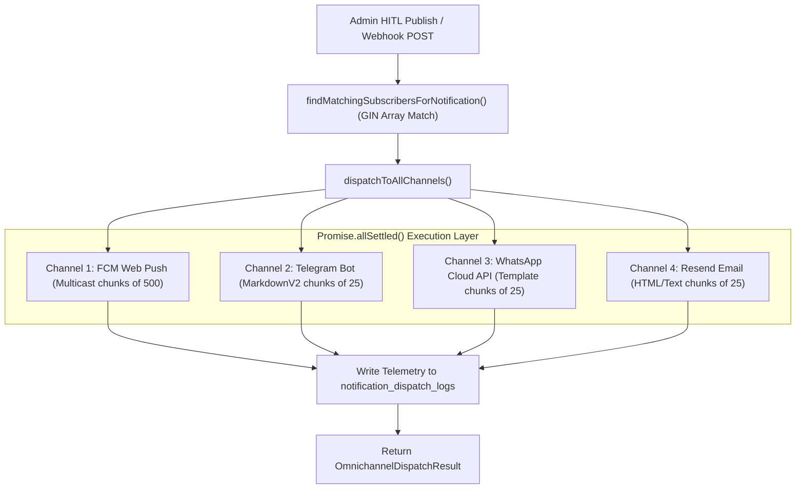

# Omnichannel Dispatch Orchestrator Design & Architecture

**Document ID**: `DESIGN-ORCHESTRATOR-DISPATCH-001`  
**Task Reference**: `TASK-05050102` (Subtask: `SUB-0505010201`)  
**Scope**: `lib/push/orchestrator.ts`, `lib/push/index.ts`, `app/api/webhooks/notification-published/route.ts`  
**Status**: Implemented  
**Date**: September 19, 2026  
**Architecture Reference**: `ADR-004` (Backend), `ADR-007` (Omnichannel Push Alert Engine), `ADR-013` (Security)  

---

## 1. Executive Summary & Objective

The **Omnichannel Dispatch Orchestrator** (`lib/push/orchestrator.ts`) is the central broadcast coordinator for UPA-GURU. Upon the publication of any verified government exam notification, it executes concurrent message distribution across all 4 alert delivery channels:
1. **FCM Web Push** (`lib/push/fcm.ts`)
2. **Telegram Bot Alerts** (`lib/push/telegram.ts`)
3. **WhatsApp Business Cloud API** (`lib/push/whatsapp.ts`)
4. **Resend Email Digest & Alerts** (`lib/push/email.ts`)

### Core Capabilities
1. **Non-Blocking Parallel Execution (`Promise.allSettled`)**:
   - Dispatches messages across all active channels concurrently rather than sequentially.
   - Eliminates cascading latency bottlenecks: a slow email network request never delays an instant Web Push or Telegram alert.
2. **Isolated Error Boundaries**:
   - If an individual channel experiences network dropouts, rate-limiting, or vendor credential errors (e.g., Meta WhatsApp token expiration), the exception is trapped and recorded inside that channel's report.
   - The remaining three channels continue execution and succeed without interruption.
3. **Automated Subscriber Match Integration**:
   - Seamlessly consumes pre-matched candidate distributions from `findMatchingSubscribersForNotification` or automatically resolves them on demand using PostgreSQL GIN array containment queries.
4. **Comprehensive Telemetry Logging**:
   - Persists granular per-channel delivery counts (`recipient_count`, `success_count`, `failure_count`, `duration_ms`, error diagnostics) into `public.notification_dispatch_logs` under strict Supabase Row Level Security (RLS).
5. **Clean Barrel Consumption**:
   - Unified export in `lib/push/index.ts` enabling clean single-line imports across API route handlers, Server Actions, and cron workers.

---

## 2. Orchestration Architecture Diagram

---

## 3. Telemetry Ledger Schema & RLS

The orchestrator logs all execution metrics to `public.notification_dispatch_logs`:
* **Columns**: `id`, `notification_id`, `channel`, `recipient_count`, `success_count`, `failure_count`, `status`, `duration_ms`, `metadata`, `created_at`.
* **Row Level Security**:
  - `Admin Full Access Dispatch Logs`: `USING (auth.jwt() ->> 'role' = 'admin')`
  - `Service Role Full Access Dispatch Logs`: `USING (auth.role() = 'service_role')`
* **Performance Indexes**:
  - `idx_dispatch_logs_notification_id`: FK lookup acceleration.
  - `idx_dispatch_logs_channel_status`: Composite index on `(channel, status, created_at DESC)` for real-time observability dashboards.

---

## 4. Security & Compliance Safeguards

1. **No Token Leakage**: Channel API keys (Firebase Server Key, Telegram Token, WhatsApp Access Token, Resend API Key) are accessed strictly in server execution contexts and never included in dispatch results.
2. **Channel Opt-In Fidelity**: Candidates only receive alerts on the channels they explicitly enabled in `user_subscriptions.preferred_channels`.
3. **Resilience Against Upstream Failures**: Complete decoupling of channel execution prevents vendor downtime from impacting UPA-GURU core application uptime.
