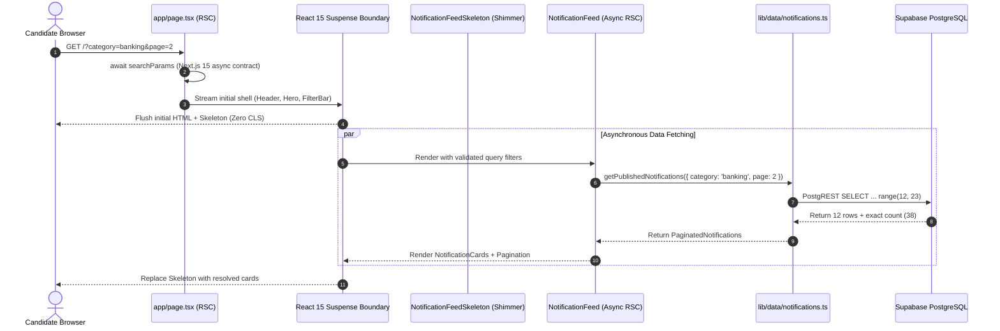

# System Design: Paginated Homepage Feed Architecture (`app/page.tsx`)

## 1. Overview & Context
- **Task ID**: `TASK-02020104` (Subtasks: `SUB-0202010401`, `SUB-0202010402`)
- **Epic**: `EPIC-02` (Candidate Portal: Notification Feed, Detail Pages & Search)
- **Feature**: `FEAT-0202` (Homepage Notification Feed with Filters & Pagination)
- **User Story**: `STORY-020201` (Candidate browsing exam notifications with filters)
- **Target Files**:
  - `app/page.tsx` (Homepage RSC)
  - `components/notifications/NotificationFeed.tsx` (Async RSC Feed)
  - `components/notifications/NotificationFeedSkeleton.tsx` (Suspense Shimmer Grid)
  - `components/notifications/Pagination.tsx` (Pagination Navigation Component)
  - `components/notifications/EmptyState.tsx` (Filtered Zero-Results State)

---

## 2. Next.js 15 Suspense Streaming Architecture

---

## 3. SEO & Lighthouse Performance Guardrails
1. **Zero Cumulative Layout Shift (CLS = 0)**: The `NotificationFeedSkeleton` matches the exact 1/2/3-column responsive grid layout, card dimensions, and structural padding of `NotificationCard`, guaranteeing a stable layout during streaming.
2. **Crawlable Navigation**: All pagination buttons render native HTML `<a>` links via `next/link`, allowing search engine web crawlers (Googlebot) to discover and index deeper pagination pages (`/?page=2`, `/?page=3`).
3. **Canonical Search Params**: Clean URL representation discards default query parameters (`page=1`, `category=all`, `state=all`), avoiding duplicate content penalties.
4. **Fast Server Execution**: Data fetching occurs directly within React Server Components in the same regional data center, executing with sub-20ms PostgREST latency.
