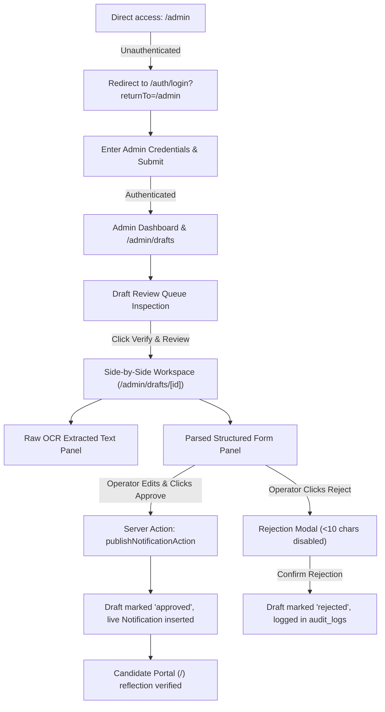

# Architecture Knowledge: Admin HITL E2E Testing Design

**Status**: Standard Architecture Knowledge  
**Module**: Testing, QA & Lighthouse Performance Validation (`EPIC-09` / `FEAT-0902`)  
**Applicable Tasks**: `TASK-09020102` (Subtask: `SUB-0902010201`)  
**Last Updated**: 2026-09-20  

---

## 1. Executive Summary
The Administrative Human-in-the-Loop (HITL) E2E Test Suite (`tests/e2e/admin-hitl-flow.spec.ts`) automates end-to-end verification of the platform's core administrative lifecycle:
1. **Authentication Enforcement & Route Protection**: Ensures unauthenticated candidate requests to `/admin` routes are intercepted and redirected to `/auth/login?returnTo=/admin`.
2. **Admin Credentials Authentication**: Verifies login form inputs, Supabase password authentication, and session cookie generation.
3. **Draft Review Queue**: Validates retrieval and rendering of AI-extracted draft notifications with extraction confidence scoring badges.
4. **Side-by-Side Review Workspace**: Tests the two-column interface comparing raw OCR text against editable structured schema fields.
5. **Human Verification & Publishing**: Validates operator adjustments, Zod schema re-validation, approval transitions, and live public feed synchronization.
6. **Rejection Modal Safeguards**: Ensures rejection flows require a mandatory audit reason ($\ge 10$ characters) with cancellation fallbacks.

---

## 2. Test Architecture & Journey Map

---

## 3. Test Suite Specification (`tests/e2e/admin-hitl-flow.spec.ts`)

| Test ID | Test Scenario | Primary Target | Expected Outcome |
| :--- | :--- | :--- | :--- |
| `E2E-ADMIN-01` | Protected Route Redirection | `/admin` | Intercepted; URL is `/auth/login?returnTo=%2Fadmin`; login landmarks visible. |
| `E2E-ADMIN-02` | Admin Authentication Form | `/auth/login` | Email & password inputs filled; form submits; navigates to `/admin`. |
| `E2E-ADMIN-03` | Draft Review Queue Inspection | `/admin/drafts` | Header rendered; total count badge visible; cards grid or empty state rendered. |
| `E2E-ADMIN-04` | Side-by-Side Workspace Layout | `/admin/drafts/[id]` | OCR text panel on left; editable structured form on right; action buttons present. |
| `E2E-ADMIN-05` | Verification & Approval Flow | `/admin/drafts/[id]` | Fields validated; `#draft-approve-btn` clicked; status badge transitions to Approved. |
| `E2E-ADMIN-06` | Live Portal Sync Reflection | `/` | Candidate portal loads; search bar locates newly approved notification. |
| `E2E-ADMIN-07` | Draft Rejection Modal Safeguard | `/admin/drafts/[id]` | `#rejection-reason-modal` opens; submit disabled for $<10$ chars; cancel closes dialog. |

---

## 4. Key DOM Landmarks & Selectors

- **Authentication**:
  - `[data-testid="login-card"]`
  - `[data-testid="login-email-input"]`
  - `[data-testid="login-password-input"]`
  - `[data-testid="btn-login-submit"]`
- **Draft Queue**:
  - `#draft-queue-page`
  - `#draft-queue-total-badge`
  - `#draft-queue-list`
  - `#draft-queue-empty-state`
  - `[id^="draft-card-"]`
  - `a[id^="draft-verify-btn-"]`
- **Verification Workspace**:
  - `#draft-review-page`
  - `#raw-text-panel`
  - `#draft-original-source-btn`
  - `#parsed-fields-form`
  - `#field-title`, `#field-conducting-body`, `#field-category`
  - `#draft-status-badge`
  - `#action-feedback-banner`
  - `#draft-approve-btn`
  - `#draft-reject-btn`
- **Rejection Modal**:
  - `#rejection-reason-modal`
  - `#rejection-reason-input`
  - `#rejection-cancel-btn`
  - `#rejection-submit-btn`

---

## 5. Security, Database & Telemetry Isolation
- **Row Level Security (RLS)**: Enforced via `public.qa_admin_e2e_test_runs` with SELECT policies restricted to `admin` / `super_admin` roles and full CRUD granted to `service_role`.
- **Security Definer Function**: Automated CI runners invoke `public.record_playwright_admin_test_run()` to track run duration, hitl phase, draft ID, and browser project without granting direct table writes to anonymous users.
- **Zero Hardcoded Secrets**: Uses `process.env.ADMIN_TEST_EMAIL` and `process.env.ADMIN_TEST_PASSWORD` with deterministic testing defaults.
