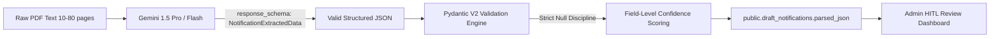

# Pydantic AI Extraction Output Schema Design

## Document Metadata
* **Task ID**: `TASK-04020101`
* **Subtasks**: `SUB-0402010101`
* **Epic / Feature**: `EPIC-04` / `FEAT-0402`
* **Architectural Decisions**: `ADR-002-Database.md`, `ADR-013-Security.md`, `ADR-015-AI-Integration.md`
* **Target Audience**: AI Engineers, Backend Engineers, HITL Reviewers

---

## 1. Executive Summary & Schema Purpose

`TASK-04020101` defines the strict Pydantic V2 domain model (`NotificationExtractedData`) serving as the contract for Google Gemini Structured Outputs (`response_schema`). 

When raw government notification text (often 10 to 80 pages) is processed by the Gemini LLM, this schema enforces JSON output formatting conforming exactly to the `public.draft_notifications.parsed_json` column.



---

## 2. Invariants & Null Discipline

1. **Sacred Null Discipline**: The AI engine must **NEVER** fabricate, estimate, or hallucinate dates, age bounds, fees, or vacancy figures to fill mandatory slots. If an item is not explicitly declared in the official PDF gazette, it must resolve to `None` (`null`).
2. **Corrigendum & Amendment Awareness**: State PSCs regularly release corrigenda (amendments) adjusting deadlines or vacancies. The schema explicitly models `is_corrigendum` and `corrigendum_details` to enable linking back to parent drafts.
3. **Structured Date Formatting**: Dates follow standard ISO 8601 (`YYYY-MM-DD`) where possible, with a raw date string fallback to preserve regional formats (e.g. "within 30 days of publication").
4. **Field Confidence & Warning Accumulation**: The model captures self-reported field completeness and flags missing critical fields (e.g. `application_end_date` missing flags a warning).

---

## 3. Pydantic Model Hierarchy

```
NotificationExtractedData (Root)
├── ImportantDates
├── AgeLimit
├── ApplicationFee
├── list[VacancyDetail]
├── list[QualificationDetail]
└── list[SelectionStage]
```

* **`ImportantDates`**: Application start/end, examination date, notification publication date.
* **`AgeLimit`**: Minimum and maximum age requirements with community relaxation breakdown.
* **`ApplicationFee`**: Fees for General, OBC, SC/ST, and Ex-Servicemen categories with payment details.
* **`VacancyDetail`**: Post title, department, pay scale, and category-wise quotas.
* **`QualificationDetail`**: Minimum degree, educational stream, and required experience in years.
* **`SelectionStage`**: Examination stages (e.g. Preliminary Objective, Mains Written, Interview/Viva, Physical Endurance Test).
