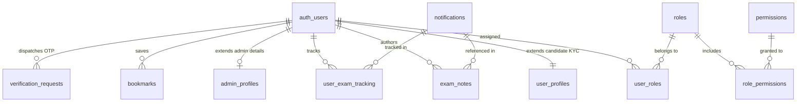

# RBAC Administration & User Profile Management Architecture Design

**Enhancement:** `ENH-RBAC-ADMIN-USER-PROFILE` (`ENH-0008`)  
**Status:** Implemented & Verified  
**Date:** 2026-09-23  
**Architecture Reference:** ADR-001 (App Router RSC), ADR-002 (Database), ADR-003 (RBAC), ADR-013 (Security)

---

## 1. Overview & Context

This design establishes an extensible Role-Based Access Control (RBAC) governance layer and a personalized Candidate Personal Workspace for the UPA-GURU exam intelligence platform.

### Core Modules Delivered:
1. **Administrative Directory & Governance (`/admin/users`, `/admin/settings/profile`)**:
   - Dynamic 5-tier role taxonomy (`super_admin`, `admin`, `moderator`, `support`, `candidate`).
   - Granular, module-namespaced permissions with zero hardcoded authorization checks.
   - Comprehensive User Directory table with search, role filters, active/blocked state toggling, and role promotion/demotion.
   - Real-time User KPI Analytics Dashboard (`Total Users`, `Active Candidates`, `Verified Accounts`, `Blocked Users`).
   - Admin account settings, department/employee ID attributes, and session management.
   - Immutable audit logging for all user lifecycle and privilege mutations.

2. **Candidate Personal Workspace (`/dashboard/*`)**:
   - Secondary sticky tab navigation (`Overview`, `Profile & KYC`, `Saved Circulars`, `Exam Notes`, `Application Tracker`, `Alert Preferences`).
   - Profile Readiness Score Gauge (`ProfileCompletionBar`) with dynamic weighted percentage calculation and next-step onboarding checklist.
   - Candidate Profile & KYC Editor (`CandidateProfileForm`) for demographics, date of birth, reservation eligibility (General, OBC, SC, ST, EWS), domicile state/district, and language preference.
   - Verified Contact Channels with simulated 6-digit OTP delivery (`sendContactOtpAction`) and verification badge (`verifyContactOtpAction`).
   - Saved Circulars & Bookmarks Manager (`BookmarksList`) with search, filter, direct official PDF view, and one-click removal.
   - Personal Exam Revision Notes (`NotesList`) with custom hashtag filtering and markdown note authoring.
   - Application & Milestone Tracker (`ApplicationTrackerList`) with interactive 5-stage stepper (Applied -> Fee Paid -> Admit Card -> Attended -> Result).

---

## 2. Entity-Relationship Data Model

---

## 3. Security & Privilege Escalation Invariants

1. **Privilege Escalation Prevention (`canAssignRole`)**:
   - An `admin` cannot grant the `super_admin` or `admin` role.
   - An `admin` cannot block or modify another `admin` or `super_admin`.
   - Only `super_admin` can manage system roles or modify role-to-permission mappings.
2. **Next.js 15 App Router Conventions**:
   - All Server Action files marked `"use server"` export strictly `async` functions. No types, interfaces, or schemas are exported from action files (preventing Turbopack compilation errors).
3. **Mandatory Row Level Security (RLS)**:
   - Candidates can only read and mutate their own bookmarks, notes, tracking records, and profile.
   - Admins can query user lists through `public.has_permission(auth.uid(), 'users:read:all')`.

---

## 4. Test Verification Summary

- **`tests/unit/rbac.test.ts` (6 tests passed)**:
  - Role hierarchy assertion
  - Super admin universal permission resolution
  - Admin operational permissions vs super_admin boundary
  - Moderator drafting and review boundary
  - Candidate workspace isolation
  - Privilege escalation guard verification via `canAssignRole`
- **`tests/unit/schemas/user-management.test.ts` (10 tests passed)**:
  - `userFilterSchema` pagination and filtering
  - `userBlockStatusSchema` constraint checking (minimum 5-character reason)
  - `assignRoleSchema` role validation
  - `accountSettingsSchema` Indian mobile regex and 6-digit PIN code validation
  - `bookmarkToggleSchema`, `examNoteSchema`, `examTrackingSchema`
- **Overall Project Suite**: 115 tests passed across 11 test suites with zero failures.
