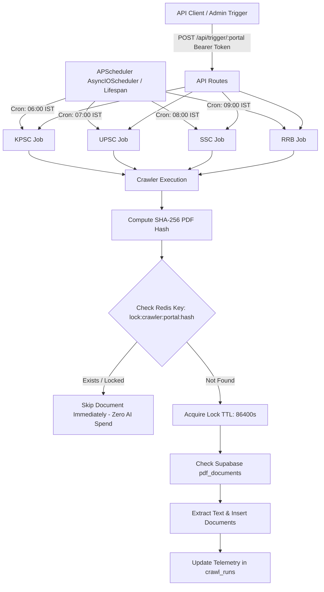

# Redis Deduplication & APScheduler Cron Jobs Design

## Document Metadata
* **Task ID**: `TASK-04010104`
* **Subtasks**: `SUB-0401010401`, `SUB-0401010402`
* **Epic / Feature**: `EPIC-04` / `FEAT-0401`
* **Architectural Decisions**: `ADR-004-Background-Workers.md`, `ADR-010-Caching.md`, `ADR-013-Security.md`
* **Target Audience**: Backend Engineers, DevOps Engineers

---

## 1. System Architecture & Workflow

`TASK-04010104` introduces two core operational capabilities to the scraper microservice:
1. **Distributed Redis Deduplication Locks**: High-speed distributed cache checks (`lock:crawler:{portal}:{pdf_hash}`) using Upstash Redis to prevent concurrent workers from processing the same PDF document simultaneously or re-processing completed documents.
2. **Autonomous APScheduler Cron Engine**: Background cron daemon executing portal crawls at scheduled times aligned with Indian Standard Time (IST, UTC+05:30):
   - **KPSC**: 06:00 IST (00:30 UTC)
   - **UPSC**: 07:00 IST (01:30 UTC)
   - **SSC**: 08:00 IST (02:30 UTC)
   - **RRB**: 09:00 IST (03:30 UTC)



---

## 2. Invariants & Guardrails

1. **Two-Tier Deduplication Defense**:
   - **Tier 1 (Transient/In-Flight Lock)**: Upstash Redis distributed key `lock:crawler:{portal}:{sha256}` with a 24-hour TTL (86,400s) prevents race conditions between parallel worker instances or rapid re-triggers.
   - **Tier 2 (Persistent Hash Record)**: PostgreSQL `public.pdf_documents(sha256_hash)` unique index permanently ensures historical deduplication.
2. **Graceful Offline Fallback**: If Upstash Redis is unreachable or credentials are missing in development, the deduplication engine falls back gracefully to in-memory set locking and database queries without crashing the microservice.
3. **Protected API Triggers**: Manual execution endpoints (`POST /api/trigger/{portal_code}`) are strictly guarded by Bearer authentication validating `SCRAPER_API_SECRET`.
4. **Timezone Fidelity**: APScheduler is explicitly configured with `Asia/Kolkata` timezone to match Indian government publication patterns.

---

## 3. Directory Layout & Module Responsibilities

```
scraper/
├── core/
│   ├── redis_client.py         # Redis client, distributed locks, offline fallback (SUB-0401010401)
├── scheduler/
│   ├── cron.py                 # APScheduler setup, job dispatch, IST triggers (SUB-0401010402)
│   └── __init__.py
├── api/
│   ├── auth.py                 # Bearer token security dependency
│   ├── routes.py               # Manual trigger, status, and job list endpoints
│   └── __init__.py
└── main.py                     # Updated with scheduler lifecycle & API router
```
