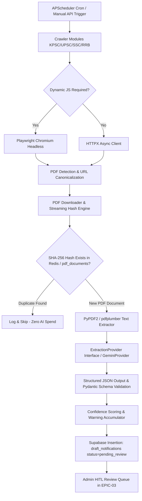

# Scraper Microservice Infrastructure Design

## Document Metadata
* **Task ID**: `TASK-04010101`
* **Subtasks**: `SUB-0401010101`, `SUB-0401010102`
* **Epic / Feature**: `EPIC-04` / `FEAT-0401`
* **Architectural Decisions**: `ADR-002-Database.md`, `ADR-004-Background-Workers.md`, `ADR-005-Hosting.md`, `ADR-013-Security.md`
* **Target Audience**: Backend Engineers, Platform Operators

---

## 1. System Overview & Architecture

The UPA-GURU Scraper Microservice is an isolated, asynchronous Python 3.12 worker application built with **FastAPI**, **Playwright**, **Google Gemini Structured Outputs**, and **APScheduler**.



---

## 2. Invariants & Safety Guardrails

1. **Sacred HITL Boundary**: The scraper worker connects to Supabase using the service role key, but write operations are strictly quarantined to:
   - `public.draft_notifications` (`status = 'pending_review'`)
   - `public.pdf_documents` (metadata & SHA-256 digest)
   - `public.crawl_runs` (telemetry, duration, errors)
   The worker **NEVER** writes directly to `public.notifications` or any candidate-facing entity.
2. **Deterministic Deduplication**: Hard SHA-256 hashing executed before invoking the LLM. If the content hash is identical to an existing document, extraction is bypassed.
3. **Null Discipline**: Unextracted fields default to `None` / `null`. Hallucination or default estimation is strictly forbidden.
4. **Vendor-Agnostic Interface**: LLM calls route through `ExtractionProvider` base class.

---

## 3. Directory Layout

```
scraper/
├── main.py                     # FastAPI app, healthcheck, lifespan management
├── requirements.txt            # Pinned production dependencies
├── Dockerfile                  # Multi-stage non-root container with Chromium
├── .dockerignore               # Docker ignore rules
├── .env.example                # Configuration environment variables template
├── config/
│   ├── __init__.py
│   ├── settings.py             # Pydantic BaseSettings loading .env
│   └── portals/                # YAML-based portal crawler configurations
├── core/
│   ├── __init__.py
│   ├── db.py                   # Supabase client singleton
│   ├── storage.py              # Supabase Storage client / local cache
│   ├── logging.py              # structlog JSON structured logger
│   └── exceptions.py           # Domain exception hierarchy
├── fetch/                      # Fetching engines (httpx, playwright)
├── crawlers/                   # Portal crawlers (base, kpsc, upsc, ssc, rrb)
├── pdf/                        # PDF downloading, hashing, text parsing
├── extraction/                 # Gemini LLM extraction, schemas, confidence
├── scheduler/                  # APScheduler cron configuration
├── alerts/                     # Webhook alert dispatching
└── api/                        # HTTP endpoints for manual triggers & status
```

---

## 4. Containerization & Security

* **Multi-Stage Build**: Base image `python:3.12-slim-bookworm`.
* **Playwright Dependencies**: Installs only necessary Chromium browser binaries via `playwright install --with-deps chromium`.
* **Least Privilege Principle**: Runs under dedicated non-root user `appuser` (UID 10001, GID 10001).
* **Signal Handling**: Graceful SIGTERM/SIGINT shutdown handling to flush active crawl tasks and close database connections cleanly.
