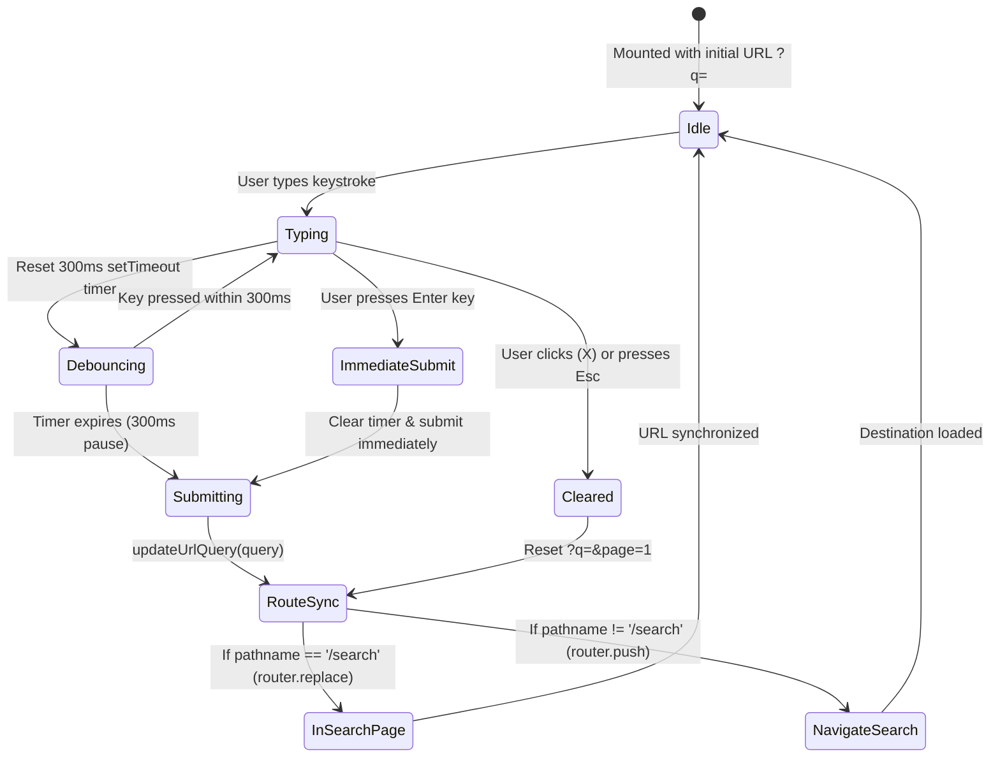

# SearchBar Client Component Architecture & Interaction Design

**Document ID**: `DESIGN-SEARCHBAR-001`  
**Task Reference**: `TASK-02040102` (Subtask: `SUB-0204010201`)  
**Epic / Feature**: `EPIC-02` / `FEAT-0204` (Full-Text Search with Debounced Input & Results Page)  
**Component**: `components/search/SearchBar.tsx`  
**Status**: Implemented  
**Date**: September 11, 2026  

---

## 1. Executive Summary & Objectives

The `SearchBar` client component serves as the ubiquitous search entry point across UPA-GURU, allowing candidates to discover exam notifications by exam name, conducting body acronym (UPSC, KPSC, SSC), post title, or notification number.

### Core Objectives:
1. **Network Query Debouncing (300ms)**: Batches user keystrokes with a 300ms pause timer, mitigating excessive API/database calls while providing a responsive typing experience.
2. **URL Parameter Synchronization**: Updates `?q=...` parameters via Next.js `useRouter.replace()` / `push()`, resetting page pagination (`?page=1`) and maintaining bookmarkable, shareable search URLs.
3. **Accessible Keyboard Shortcuts**: Implements global standard shortcuts (`⌘K` / `Ctrl+K` and `/`) for instant search activation, and `Escape` for rapid input clearing.
4. **Visual Feedback & State Machine**: Displays an active pending transition spinner (`Loader2`) while Next.js transitions routes, and a one-click clear button (`X`) when text is present.

---

## 2. Component State Machine & Debounce Flow

---

## 3. Specifications & UX Details

| Feature | Implementation | Accessibility / UX Impact |
| :--- | :--- | :--- |
| Debounce Duration | `300ms` | Optimal balance between server load and candidate responsiveness. |
| URL Synchronization | `startTransition(() => router.replace(..., { scroll: false }))` | Non-blocking React 19 transition, preserves scroll position on `/search`. |
| Keyboard Shortcut | `Cmd+K` / `Ctrl+K` / `/` | Standardized keyboard navigation for power users. |
| Escape Key | Clears input if populated; blurs input if empty. | Reduces friction when canceling an unintended search. |
| Clear Action | One-click `X` button | Allows rapid clearing without backspacing. |
| Loading Indicator | `isPending` via `useTransition` | Visual indicator during server query resolution. |

---

## 4. Test Landmarks & Automation Selectors

| Test ID / Selector | Purpose |
| :--- | :--- |
| `id="search-bar-input"` / `data-testid="search-bar-input"` | Main text input element for Playwright assertions |
| `id="search-clear-btn"` / `data-testid="search-clear-btn"` | Clear button assertion |
| `id="search-bar-spinner"` / `data-testid="search-bar-spinner"` | Loading state spinner during route transitions |
| `id="search-bar-icon"` / `data-testid="search-bar-icon"` | Resting magnifying glass search icon |
