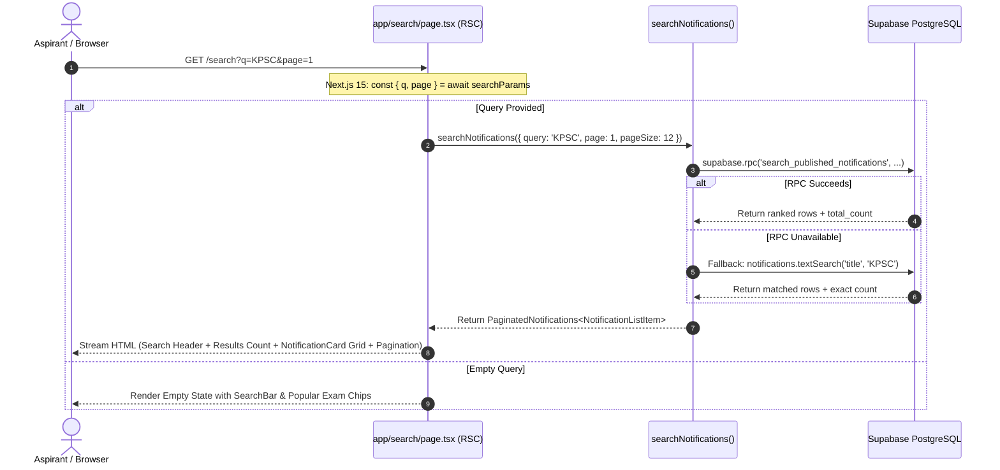

# Search Results Page Architecture & UX Design

**Document ID**: `DESIGN-SEARCH-RESULTS-001`  
**Task Reference**: `TASK-02040103` (Subtasks: `SUB-0204010301`, `SUB-0204010302`)  
**Epic / Feature**: `EPIC-02` / `FEAT-0204` (Full-Text Search with Debounced Input & Results Page)  
**Route**: `/search` (`app/search/page.tsx`, `lib/data/notifications.ts`)  
**Status**: Implemented  
**Date**: September 11, 2026  

---

## 1. Executive Summary & Objective

The Search Results Page (`/search`) delivers an authoritative, high-speed keyword search experience for candidates looking for specific examination notifications across India.

### Key Architectural Pillars:
1. **Multi-Engine Search Data Access**: Implemented in `lib/data/notifications.ts` via `searchNotifications()`:
   - Primary: High-speed PostgreSQL RPC function `search_published_notifications` utilizing GIN index acceleration and weighted ranking (`ts_rank_cd`).
   - Fallback: PostgREST websearch query builder using native `.textSearch('title', ...)` ensuring continuous service availability across diverse environments.
2. **0KB Client Hydration Grid**: Implemented as a pure React Server Component (RSC), pre-rendering notification cards on the server while streaming results to the client.
3. **SEO Best Practices**: Dynamically generates `robots: { index: false, follow: true }` to prevent search engine index bloat from low-value, duplicate internal search results (Google Search Central guideline).
4. **Three-Tier UX States**:
   - Empty Query State (`!q`): Invites candidate exploration with popular exam chips and category suggestions.
   - Matching Results State (`q && total > 0`): Highlights total match counts, provides multi-column `NotificationCard` grid, and server-side pagination.
   - Zero-Match Recovery State (`q && total === 0`): Suggests spelling fixes, broader authority terms, and recovery CTAs to prevent dead ends.

---

## 2. Server Component Pipeline & Execution Flow

---

## 3. SEO & Playwright Automation Landmarks

### SEO Metadata
- **Title**: `Search: "{query}" | UPA-GURU`
- **Robots**: `noindex, follow` (Google compliance to avoid internal search index pollution).

### Automation Test Landmarks
| Landmark / Test ID | Element / Role | Purpose |
| :--- | :--- | :--- |
| `search-results-page` | `<main>` container | Root test container for `/search` |
| `search-hero-banner` | `<section>` | Hero search bar section |
| `search-results-count` | `
` | Validates reported result numbers |
| `search-results-grid` | `
` | Container for `NotificationCard` instances |
| `search-empty-state` | `<section>` | Zero-query prompt assertion |
| `search-no-results` | `<section>` | Zero-match fallback assertion |
