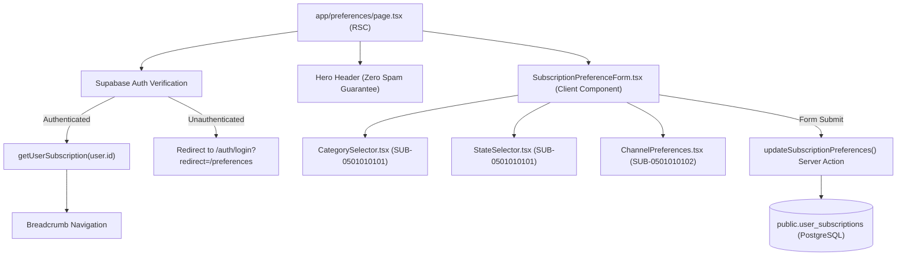

# Candidate Subscription Preference Center Design & Architecture

**Document ID**: `DESIGN-SUB-PREF-001`  
**Task Reference**: `TASK-05010101` (Subtasks: `SUB-0501010101`, `SUB-0501010102`)  
**Route**: `/preferences` (`app/preferences/page.tsx`)  
**Status**: Implemented  
**Date**: September 19, 2026  
**Architecture Reference**: `ADR-001` (Frontend RSC), `ADR-002` (Database), `ADR-003` (Authentication/RBAC), `ADR-007` (Omnichannel Alert Engine), `ADR-013` (Security)

---

## 1. Executive Summary & Objective

The **Candidate Subscription Preference Center** empowers candidates to customize their real-time notification alerts across competitive exam categories, geographic state jurisdictions, and omnichannel delivery mechanisms (Web Push, Telegram, WhatsApp, Email).

By capturing fine-grained alert criteria, UPA-GURU enforces a **Zero Spam Guarantee**—dispatching automated alerts only when published notifications match a candidate's explicit preferences.

### Architectural Tenets
1. **Next.js 15 Server-First Architecture**: Implemented as a React Server Component (`app/preferences/page.tsx`) that enforces authentication, prefetches user subscriptions server-side, and renders an interactive Client Form (`components/preferences/SubscriptionPreferenceForm.tsx`).
2. **Atomic Server Action Upsert**: Form submissions execute via Next.js 15 Server Action (`app/preferences/actions.ts`) with strict session-bound user ID binding (prevents Insecure Direct Object Reference / IDOR vulnerabilities).
3. **Zod Strict Validation**: Two-layer validation guarantees data sanitization, E.164 phone formatting, and channel-dependent input constraints.
4. **Resilient Data Access**: The data access layer and server action seamlessly handle both pre-existing and newly initialized subscription rows in `public.user_subscriptions`.

---

## 2. Component Hierarchy & Layout



---

## 3. Database Schema & Migration Script

### Target Table: `public.user_subscriptions`
```sql
CREATE TABLE IF NOT EXISTS public.user_subscriptions (
    id UUID PRIMARY KEY DEFAULT uuid_generate_v4(),
    user_id UUID REFERENCES auth.users(id) ON DELETE CASCADE,
    preferred_channels TEXT[] DEFAULT ARRAY['web_push'],
    telegram_chat_id TEXT,
    whatsapp_phone_number TEXT,
    fcm_device_token TEXT,
    subscribed_exam_ids UUID[],
    subscribed_categories exam_category_enum[],
    subscribed_states TEXT[],
    created_at TIMESTAMPTZ DEFAULT NOW(),
    updated_at TIMESTAMPTZ DEFAULT NOW()
);
```

### Database Script for Supabase (Unique Constraint & Deduplication)
To support clean upserting on `user_id`, run the following idempotent script in the Supabase SQL Editor:

```sql
-- 1. Deduplicate existing rows in user_subscriptions, keeping the most recently updated row per user
DELETE FROM public.user_subscriptions
WHERE id NOT IN (
    SELECT DISTINCT ON (user_id) id
    FROM public.user_subscriptions
    ORDER BY user_id, updated_at DESC
);

-- 2. Add Unique Constraint on user_id
ALTER TABLE public.user_subscriptions
DROP CONSTRAINT IF EXISTS user_subscriptions_user_id_key;

ALTER TABLE public.user_subscriptions
ADD CONSTRAINT user_subscriptions_user_id_key UNIQUE (user_id);

-- 3. Ensure Index for Fast Subscriber Matching
CREATE INDEX IF NOT EXISTS idx_user_subscriptions_channels ON public.user_subscriptions USING GIN (preferred_channels);
CREATE INDEX IF NOT EXISTS idx_user_subscriptions_categories ON public.user_subscriptions USING GIN (subscribed_categories);
CREATE INDEX IF NOT EXISTS idx_user_subscriptions_states ON public.user_subscriptions USING GIN (subscribed_states);

-- 4. Verify Row Level Security (RLS) Policies
ALTER TABLE public.user_subscriptions ENABLE ROW LEVEL SECURITY;

DROP POLICY IF EXISTS "User Subscriptions Own Access" ON public.user_subscriptions;

CREATE POLICY "User Subscriptions Own Access" ON public.user_subscriptions
    FOR ALL
    USING (auth.uid() = user_id)
    WITH CHECK (auth.uid() = user_id);
```

---

## 4. Input Validation & Domain Types

### Zod Schema (`lib/schemas/subscriptions.ts`)
```typescript
export const subscriptionPreferencesSchema = z.object({
  subscribedCategories: z.array(z.enum(EXAM_CATEGORIES_TUPLE)).default([]),
  subscribedStates: z.array(z.string().trim().min(1)).default([]),
  preferredChannels: z.array(z.enum(NOTIFICATION_CHANNELS_TUPLE)).min(1),
  telegramChatId: z.string().trim().max(64).optional().or(z.literal("")),
  whatsappPhoneNumber: z.string().trim().max(20).optional().or(z.literal("")),
}).superRefine((data, ctx) => {
  if (data.preferredChannels.includes("whatsapp") && !data.whatsappPhoneNumber) {
    ctx.addIssue({
      code: z.ZodIssueCode.custom,
      path: ["whatsappPhoneNumber"],
      message: "WhatsApp phone number is required when WhatsApp alerts are enabled",
    });
  }
});
```

---

## 5. Security & RBAC Guardrails
- **IDOR Protection**: The Server Action strictly extracts `user.id` from `supabase.auth.getUser()`. A candidate cannot mutate preferences belonging to another candidate.
- **Mandatory RLS**: All read and write operations on `user_subscriptions` are guarded by PostgreSQL RLS with `auth.uid() = user_id`.
- **Zero Secrets in Client**: Telegram bot tokens, Firebase admin keys, and WhatsApp credentials are never exposed to client bundles.
