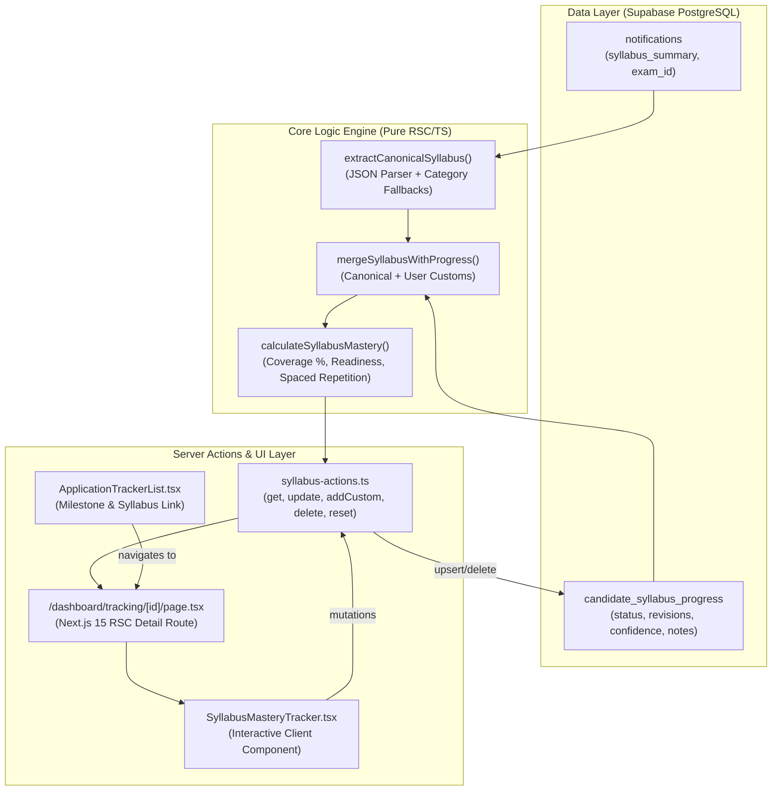

# Architectural Design: Interactive Exam Syllabus & Subject Mastery Tracker

**Enhancement ID:** `ENH-0011`  
**Epic ID:** `EPIC-13`  
**Status:** Completed  
**Owner:** Fullstack Engineer / System Architect  
**Date:** 2026-09-24  
**Architecture Compliance:** Next.js 15 App Router, React Server Components (RSC), Supabase RLS, Zod, Vitest  

---

## 1. Executive Summary & Value Proposition

Prior to `ENH-0011`, UPA-GURU served primarily as an **alert and discovery portal** for government examinations. Once a candidate discovered and applied for an exam, there was no daily mechanism to retain and guide the candidate across their 3-12 month preparation lifecycle.

`ENH-0011` transforms UPA-GURU into an **interactive preparation companion**:
- **Topic-by-Topic Syllabus Checklist**: Decomposes complex exam notifications into actionable subjects and sub-topics.
- **Mastery & Exam Readiness Scoring**: Weighted progress tracking (`Not Started`, `In Progress`, `Completed`, `Needs Revision`), plus confidence ratings (1-5 stars) and revision frequency bonuses.
- **Spaced-Repetition System**: Alerts candidates when topics have not been reviewed for more than 7 days to reinforce long-term memory.
- **Custom Topic Insertion**: Candidates can tailor standard syllabi with custom coaching institute modules or reference textbook chapters.

---

## 2. Architecture & Data Flow



---

## 3. Database Schema Reference

**Table:** `public.candidate_syllabus_progress`

```sql
CREATE TABLE IF NOT EXISTS public.candidate_syllabus_progress (
    id UUID PRIMARY KEY DEFAULT gen_random_uuid(),
    user_id UUID NOT NULL REFERENCES auth.users(id) ON DELETE CASCADE,
    notification_id UUID NOT NULL REFERENCES public.notifications(id) ON DELETE CASCADE,
    subject_key TEXT NOT NULL,
    topic_title TEXT NOT NULL,
    status TEXT NOT NULL DEFAULT 'not_started' CHECK (status IN ('not_started', 'in_progress', 'completed', 'needs_revision')),
    revision_count INTEGER NOT NULL DEFAULT 0 CHECK (revision_count >= 0),
    confidence_level INTEGER DEFAULT 1 CHECK (confidence_level BETWEEN 1 AND 5),
    last_reviewed_at TIMESTAMPTZ,
    notes TEXT,
    created_at TIMESTAMPTZ DEFAULT NOW(),
    updated_at TIMESTAMPTZ DEFAULT NOW(),
    UNIQUE (user_id, notification_id, subject_key, topic_title)
);
```

### Row Level Security (RLS)
- `SELECT`: `auth.uid() = user_id OR public.has_permission(auth.uid(), 'users:read:all')`
- `INSERT`: `WITH CHECK (auth.uid() = user_id)`
- `UPDATE`: `USING (auth.uid() = user_id) WITH CHECK (auth.uid() = user_id)`
- `DELETE`: `USING (auth.uid() = user_id)`

---

## 4. Mastery & Readiness Scoring Algorithm

### 4.1 Weighted Subject Coverage
Each topic carries weighted points based on its preparation state:
$$\text{Topic Points} = \begin{cases} 1.0 & \text{if Completed} \\ 0.6 & \text{if Needs Revision} \\ 0.4 & \text{if In Progress} \\ 0.0 & \text{if Not Started} \end{cases}$$

$$\text{Mastery Percentage} = \text{round}\left(\frac{\sum \text{Topic Points}}{\text{Total Topics}} \times 100\right)$$

### 4.2 Composite Exam Readiness Score (0–100)
Readiness incorporates breadth (coverage), depth (repeated revisions), and candidate confidence:
$$\text{Readiness Score} = \min\left(100, \text{round}\left(\text{Mastery} \times 0.70 + \text{Revision Bonus} \times 0.20 + \text{Confidence Bonus} \times 0.10\right)\right)$$
- **Revision Bonus**: Capped at 20 points based on average revisions per topic (target: 2 revisions/topic).
- **Confidence Bonus**: Up to 10 points based on 1–5 star self-assessment average.

### 4.3 Spaced Repetition Detection
A topic triggers the Spaced Repetition alert if:
1. `status === 'needs_revision'` OR
2. `last_reviewed_at` is older than 7 calendar days ($> 604,800,000 \text{ ms}$).

---

## 5. Category Fallback Templates

If a notification's `syllabus_summary` is null or only high-level text, standard templates automatically populate structured topics for:
- `civil_services`: General Studies Paper I & CSAT Paper II
- `state_psc`: State Heritage & Admin, General Mental Ability & Regional Language
- `banking`: Reasoning Ability, Quantitative Aptitude, General & Financial Awareness, English
- `railways`: Mathematics, General Intelligence & Reasoning, General Science, General Awareness
- `police`: General Knowledge & Law Awareness, Mental Ability & Aptitude
- `defense`: Mathematics, General Ability Test
- `teaching`: Child Development & Pedagogy, Language & Subject Content
- `other`: General Studies & Aptitude

---

## 6. Verification & Test Suite

15 test files and 174 automated unit tests confirm behavior:
- `tests/unit/syllabus-tracker.test.ts` (14 tests) covering:
  - Canonical fallback extraction
  - Delimiter & bullet string parsing
  - Progress record merging and custom topic preservation
  - Spaced repetition detection
  - Zod validation schemas
