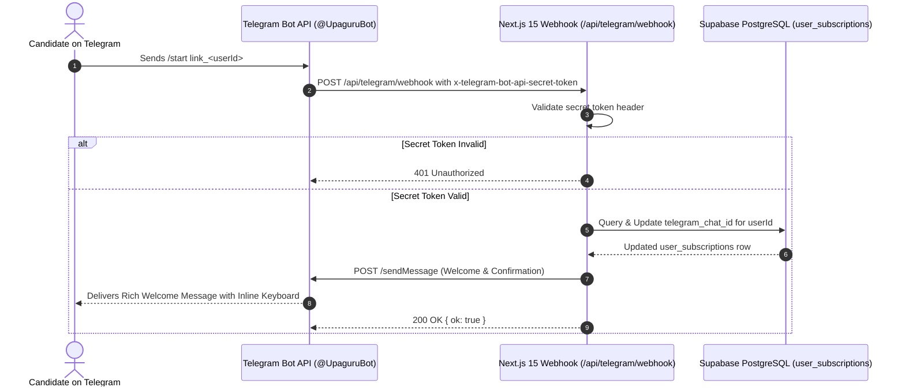

# Telegram Bot Alert Integration & Webhook Handler Design

**Document ID**: `DESIGN-TELEGRAM-BOT-001`  
**Task Reference**: `TASK-05030101` (Subtasks: `SUB-0503010101`, `SUB-0503010102`)  
**Route**: `POST /api/telegram/webhook` (`app/api/telegram/webhook/route.ts`)  
**Status**: Implemented  
**Date**: September 19, 2026  
**Architecture Reference**: `ADR-004` (Backend), `ADR-007` (Omnichannel Push Alert Engine), `ADR-013` (Security), `ADR-014` (API Design)

---

## 1. Executive Summary & Objective

The **Telegram Bot Alert Integration** delivers instant, rich-text competitive exam notifications and deadline countdowns directly to candidates on Telegram. Telegram offers 100% free delivery, instant mobile push alerts, and high-throughput broadcast capabilities.

### Key Capabilities
1. **Authenticated Webhook Ingestion**: Validates the `x-telegram-bot-api-secret-token` header on all incoming requests to guarantee that updates originate exclusively from the official Telegram Bot API gateway.
2. **Seamless Deep-Link Account Binding**: Supports `/start link_<userId>` deep links, enabling candidates to connect their Telegram chat ID with a single click from the UPA-GURU Alert Preferences center.
3. **Interactive Self-Service Commands**:
   - `/start`: Returns the candidate's Chat ID and step-by-step connection instructions with interactive inline buttons.
   - `/status`: Queries `public.user_subscriptions` to report the candidate's active categories and states.
   - `/stop`: Pauses Telegram alerts and dissociates the chat ID.
   - `/help`: Lists available bot commands.
4. **Resilient Mock Mode**: Simulates message delivery in local development environments when `TELEGRAM_BOT_TOKEN` is unconfigured.

---

## 2. Sequence Diagram & Authentication Flow



---

## 3. Database Schema & Migration

### Target Column: `public.user_subscriptions.telegram_chat_id`
```sql
-- Migration Script: .agents/knowledge/database/telegram-bot-schema-v1.sql
CREATE INDEX IF NOT EXISTS idx_user_subscriptions_telegram 
    ON public.user_subscriptions (telegram_chat_id) 
    WHERE telegram_chat_id IS NOT NULL;
```

---

## 4. Security & Compliance Guardrails
- **Secret Header Guardrail**: Rejects unauthorized webhook invocations without `x-telegram-bot-api-secret-token`.
- **Privileged DB Access**: Uses `createAdminClient()` exclusively within the webhook Route Handler on the server; the service role key is never bundled to client applications.
- **Input Sanitization**: User IDs and chat IDs are strictly validated using regex before database mutations.
