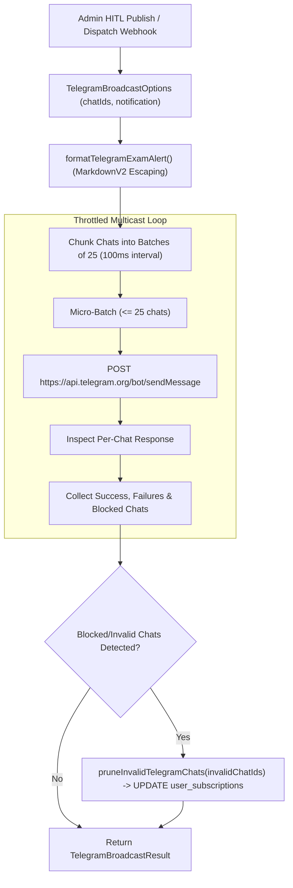

# Telegram Broadcast Alert Engine Design & Architecture

**Document ID**: `DESIGN-TELEGRAM-DISPATCH-001`  
**Task Reference**: `TASK-05030102` (Subtask: `SUB-0503010201`)  
**Scope**: `lib/push/telegram.ts`, `lib/push/index.ts`  
**Status**: Implemented  
**Date**: September 19, 2026  
**Architecture Reference**: `ADR-004` (Backend), `ADR-007` (Omnichannel Push Alert Engine), `ADR-013` (Security)

---

## 1. Executive Summary & Objective

The **Telegram Broadcast Alert Engine** (`lib/push/telegram.ts`) is the server-side multicast distribution service responsible for broadcasting real-time exam notifications to thousands of candidate Telegram chats.

### Core Capabilities
1. **Telegram MarkdownV2 Entity Escaping**: Formats exam notices with rich styling (bold post titles, emojis, formatted vacancy numbers, application deadlines) while escaping reserved characters (`_ * [ ] ( ) ~ > # + - = | { } . ! \`) to prevent Telegram parse errors.
2. **Rate Limit Throttling**: Telegram strictly enforces an API limit of approximately 30 messages/second. The dispatcher partitions target chats into micro-batches of 25 with a 100ms interval, ensuring maximum broadcast velocity without triggering HTTP 429 Too Many Requests.
3. **Automated Stale/Blocked Chat Pruning**: Automatically detects blocked bots (`Forbidden: bot was blocked by the user`, `Bad Request: chat not found`) and sets `telegram_chat_id = NULL` in `public.user_subscriptions`.
4. **Actionable Deep-Link Keyboards**: Embeds interactive inline keyboard buttons linking directly to `/notification/[slug]`, official authority portals, and application PDFs.

---

## 2. Broadcast Workflow Architecture



---

## 3. Formatting Contract & MarkdownV2 Guardrails

```typescript
export function escapeMarkdownV2(text: string): string {
  if (!text) return "";
  return text.replace(/([_*\[\]()~>#+\-=|{}.!\\])/g, "\\$1");
}
```

Sample Rendered Message:
```text
📢 *NEW RECRUITMENT NOTIFICATION*

🏛️ *Authority:* Karnataka Public Service Commission
📋 *Post:* *Gazetted Probationer Preliminary Exam 2026*
🏷️ *Category:* STATE PSC
👥 *Total Vacancies:* 384
⏳ *Last Date to Apply:* 2026\-10\-15

━━━━━━━━━━━━━━━━━━━
⚡ _Delivered instantly by UPA\-GURU Pan\-India Exam Intelligence_

[Buttons: 📄 View Full Details & Syllabus | 🌐 Apply Online | 📥 Official PDF]
```

---

## 4. Automated Chat Pruning (`pruneInvalidTelegramChats`)

When Telegram returns `Forbidden: bot was blocked by the user` or `Bad Request: chat not found`:
```typescript
await supabaseAdmin
  .table("user_subscriptions")
  .update({ telegram_chat_id: null, updated_at: new Date().toISOString() })
  .in("telegram_chat_id", invalidChatIds);
```

---

## 5. Security & Isolation Guardrails
- **Token Protection**: `TELEGRAM_BOT_TOKEN` is loaded strictly server-side; browser bundles never receive the bot token.
- **Service Role Scoping**: Chat pruning uses elevated `createAdminClient()` exclusively on the server.
- **Graceful Mock Fallback**: Local developer workflows run seamlessly even if Telegram bot tokens are absent.
