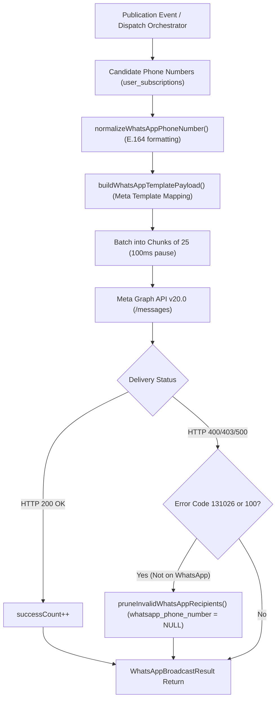

# WhatsApp Business API Dispatch Engine Design & Architecture

**Document ID**: `DESIGN-WHATSAPP-DISPATCH-001`  
**Task Reference**: `TASK-05040101` (Subtask: `SUB-0504010101`)  
**Scope**: `lib/push/whatsapp.ts`, `lib/push/index.ts`  
**Status**: Implemented  
**Date**: September 19, 2026  
**Architecture Reference**: `ADR-004` (Backend), `ADR-007` (Omnichannel Push Alert Engine), `ADR-013` (Security)  

---

## 1. Executive Summary & Objective

The **WhatsApp Business API Dispatch Engine** (`lib/push/whatsapp.ts`) manages direct, high-urgency notifications to candidates' WhatsApp accounts via the Meta WhatsApp Business Cloud API (Graph API v20.0).

WhatsApp messages carry a direct cost and have strict spam and opt-in policies. As outlined in `ADR-007`, this channel is reserved for high-value alerts (new major notifications, deadline reminders, and admit card releases) using pre-approved Meta message templates.

### Core Capabilities
1. **E.164 Phone Normalization (`normalizeWhatsAppPhoneNumber`)**: Sanitizes candidate phone inputs, strips unwanted characters, and deterministically normalizes 10-digit Indian numbers (`9876543210` -> `919876543210`) to comply with Meta Graph API formatting.
2. **Meta Template Parameter Mapping (`buildWhatsAppTemplatePayload`)**: Maps exam notification metadata (Title, Conducting Body, Vacancies, Last Date, Category) to template placeholder slots (`{{1}}`..`{{4}}`) and injects dynamic slug suffixes into interactive CTA URL buttons.
3. **Throttled Multicast Delivery (`sendWhatsAppBroadcast`)**: Batches broadcasts into micro-chunks of 25 with 100ms intervals, safely delivering ~25 requests/sec well within Meta's 80 req/sec Tier-1 threshold.
4. **Self-Healing Recipient Pruning (`pruneInvalidWhatsAppRecipients`)**: Automatically clears invalid, blocked, or non-WhatsApp numbers (`error 131026: User is not on WhatsApp`) from `public.user_subscriptions` via the Supabase admin client.
5. **Development Simulation Mode**: In non-production environments without Meta credentials, logs mock dispatches and returns synthetic message IDs to maintain uninterrupted developer experience.

---

## 2. Dispatch Workflow Architecture

---

## 3. Template Payload Specifications

### Template Structure (`exam_alert_notification`)

* **Header**: Text (`{{1}}` = Notification Title, capped at 60 characters)
* **Body**:
  * `{{1}}` = Conducting Body (e.g. *Union Public Service Commission*)
  * `{{2}}` = Total Vacancies (e.g. *1,056 Posts*)
  * `{{3}}` = Last Date to Apply (e.g. *15 Oct 2026*)
  * `{{4}}` = Category (e.g. *CIVIL SERVICES*)
* **Button Component**:
  * Type: `url`
  * Index: `0`
  * Parameter: Notification slug (e.g. `upsc-civil-services-2026`) resulting in target URL `https://upaguru.in/notification/{{1}}`

---

## 4. Security & Compliance Safeguards

1. **Server-Side Credential Isolation**: `WHATSAPP_ACCESS_TOKEN` and `WHATSAPP_PHONE_NUMBER_ID` are protected by runtime browser-detection guards.
2. **No Hardcoded Tokens**: Configured exclusively via `process.env`.
3. **Opt-in & Rate Limiting**: Deliveries only target candidates who explicitly opted into the `whatsapp` channel in `user_subscriptions`.
4. **Isolated Failure Boundaries**: Individual recipient delivery failures are trapped locally, preventing single-number errors from terminating the multicast sequence.
