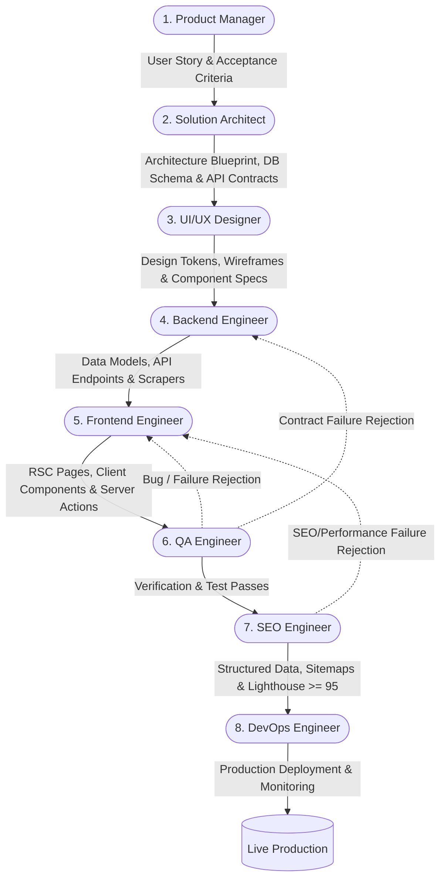

# UPA-GURU Development Workflow

## Overview
This document defines the end-to-end software development lifecycle (SDLC) for the UPA-GURU platform. Every feature, enhancement, and bugfix must strictly traverse through this sequential 8-stage pipeline to guarantee architectural integrity, security compliance, zero regressions, and top-tier SEO/performance standards.

---

## Workflow Pipeline Diagram



---

## Sequential Stages & Handover Protocols

### 1. Product Manager (`ProductManager.md`)
* **Primary Objective**: Define user intent, assess business viability, establish MVP boundaries, and formulate measurable acceptance criteria.
* **Key Activities**:
  - Break down roadmap epics into features and granular user stories.
  - Prioritize tasks (`P0`, `P1`, `P2`) in [task-backlog.json](file:///d:/Prajna%20Development/Dev%20Projects/upaguru/.agents/task-backlog.json).
  - Draft user stories using standard syntax: *"As a [role], I want [capability] so that [benefit]."*
* **Stage Gate / Exit Criteria**:
  - [ ] Story has unambiguous, testable acceptance criteria.
  - [ ] Priority, dependencies, and initial effort estimations are recorded.
  - [ ] Dependencies on upstream deliverables are verified and unblocked.
* **Handover Artifacts**: Updated `task-backlog.json` story entry with status `Pending`.

---

### 2. Solution Architect (`SolutionArchitect.md`)
* **Primary Objective**: Establish the technical strategy, data modeling, security rules, and integration contracts.
* **Key Activities**:
  - Evaluate alignment with existing ADRs (ADR-001 through ADR-015) or author new ADRs under [decisions/](file:///d:/Prajna%20Development/Dev%20Projects/upaguru/.agents/knowledge/architecture/decisions/).
  - Create or update PostgreSQL DDL scripts with mandatory Row Level Security (RLS) policies and indexes in `schema-v1.sql`.
  - Define API contracts (OpenAPI 3.0 specs, TypeScript interfaces, and Pydantic schemas).
  - Review data flow impacts across the candidate portal, ingestion pipeline, and push dispatchers.
* **Stage Gate / Exit Criteria**:
  - [ ] PostgreSQL table changes include explicit RLS policies (`SELECT`, `INSERT`, `UPDATE`, `DELETE`).
  - [ ] Schema changes are backward-compatible.
  - [ ] All architecture decisions are documented in an accepted ADR.
* **Handover Artifacts**: Migration scripts, TypeScript/Pydantic schemas, and updated ADR documents.

---

### 3. UI/UX Designer (`UIUXDesigner.md`)
* **Primary Objective**: Craft accessible, high-performance, mobile-first design specifications that deliver exceptional user experience.
* **Key Activities**:
  - Define component aesthetics using design tokens (Tailwind / Vanilla CSS variables).
  - Specify responsive layouts across mobile (320px+), tablet, and desktop viewports.
  - Annotate interactive states (hover, focus, active, loading skeletons, error states).
  - Ensure WCAG 2.1 AA accessibility (color contrast ratios ≥ 4.5:1, semantic landmarks, unique element IDs).
* **Stage Gate / Exit Criteria**:
  - [ ] Designs adhere strictly to mobile-first responsive guidelines.
  - [ ] Interactive elements specify unique IDs for automated Playwright locators.
  - [ ] Contrast ratios and typography scale comply with WCAG 2.1 AA standards.
* **Handover Artifacts**: Layout specifications, CSS design tokens, and component mockups.

---

### 4. Backend Engineer (`BackendEngineer.md`)
* **Primary Objective**: Implement server-side logic, database interactions, external service integrations, and web scrapers.
* **Key Activities**:
  - Implement and run Supabase schema migrations, indexes, and RLS triggers.
  - Build Python crawler modules (FastAPI, Playwright, APScheduler) for government exam portals.
  - Implement the Gemini LLM extraction pipeline with structured JSON parsing and confidence scoring.
  - Build push dispatch services (FCM Web Push, Telegram Bot API, WhatsApp Business API, Resend Email).
  - Create public REST API routes (`/api/v1/*`) and webhook handlers with Upstash Redis rate limiting.
* **Stage Gate / Exit Criteria**:
  - [ ] All database queries comply with RLS and utilize connection pooling (Supavisor).
  - [ ] API endpoints validate inputs with Pydantic/Zod and return RFC 7807 problem details on error.
  - [ ] Zero hardcoded secrets; all credentials are read from `process.env`.
  - [ ] Administrative state transitions write an entry to `public.audit_logs`.
* **Handover Artifacts**: Scraper modules, API route handlers, and backend services ready for frontend consumption.

---

### 5. Frontend Engineer (`FrontendEngineer.md`)
* **Primary Objective**: Build responsive, type-safe, server-rendered web pages and interactive UI components.
* **Key Activities**:
  - Implement Next.js 15 App Router pages using React Server Components (RSC) for zero-bundle data fetching.
  - Build interactive client components (`"use client"`) for debounced search, filter controls, and modals.
  - Write Server Actions for internal mutations with strict Zod validation.
  - Implement Supabase data access layer functions (`lib/data/*`).
  - Wire up ISR cache invalidation hooks (`revalidatePath`, `revalidateTag`) in mutation actions.
* **Stage Gate / Exit Criteria**:
  - [ ] Zero TypeScript (`strict: true`) or ESLint errors; no `@ts-ignore` or `any` workarounds.
  - [ ] All forms and search queries validate through strict Zod schemas.
  - [ ] Client components isolated strictly to interactive leaves; RSC used for all static content.
* **Handover Artifacts**: Completed Next.js route components, Server Actions, and UI integration.

---

### 6. QA Engineer (`QAEngineer.md`)
* **Primary Objective**: Validate functional correctness, verify non-functional benchmarks, and ensure zero regressions.
* **Key Activities**:
  - Write and run Vitest unit tests for Zod schemas, Server Actions, and helper utilities.
  - Develop Playwright end-to-end tests for critical candidate and admin verification workflows.
  - Execute automated tests and benchmark suites (LLM extraction accuracy ≥ 90%).
  - Verify error handling and edge cases without masking symptoms.
* **Stage Gate / Exit Criteria**:
  - [ ] All unit and integration tests pass cleanly with required assertions.
  - [ ] Critical candidate and admin user journeys pass in Playwright E2E tests.
  - [ ] No empty `try/catch` blocks or suppressed test failures exist in the codebase.
* **Handover Artifacts**: Test suites (`__tests__/*`, `e2e/*`), execution logs, and QA sign-off certificate.

---

### 7. SEO Engineer (`SEOEngineer.md`)
* **Primary Objective**: Guarantee search engine discoverability, programmatic rich results, and elite Core Web Vitals.
* **Key Activities**:
  - Implement dynamic `generateMetadata()` for canonical URLs, titles, descriptions, and OpenGraph cards.
  - Inject Google-compliant `JobPosting` and `Event` JSON-LD schemas into `<head>`.
  - Validate structured data output via the Google Rich Results Test tool (zero errors/warnings).
  - Update dynamic XML sitemaps (`/sitemap.xml`) and `robots.txt`.
  - Run Lighthouse CI mobile audits on all public dynamic routes.
* **Stage Gate / Exit Criteria**:
  - [ ] Lighthouse Mobile SEO score is ≥ 95.
  - [ ] Lighthouse Mobile Performance score is ≥ 95.
  - [ ] Google Rich Results Test passes with 0 errors and 0 warnings.
  - [ ] Structured data renders semantic `JobPosting` / `Event` tags on all notification detail routes.
* **Handover Artifacts**: Validated metadata configurations, JSON-LD schemas, sitemaps, and Lighthouse CI audit reports.

---

### 8. DevOps Engineer (`DevOpsEngineer.md`)
* **Primary Objective**: Provision infrastructure, manage CI/CD deployment pipelines, configure monitoring, and maintain production health.
* **Key Activities**:
  - Validate environment variables across Vercel, Supabase, Upstash Redis, and AWS/Railway runtimes.
  - Deploy Next.js frontend to Vercel Edge Network with ISR and CDN edge caching.
  - Deploy containerized Python workers (Docker) with healthcheck heartbeats.
  - Configure error tracking (Sentry) and uptime monitoring (Healthchecks.io + Telegram alerts).
  - Verify SSL certificates, DNS routing, and HTTP security headers (CSP, HSTS, CORS).
* **Stage Gate / Exit Criteria**:
  - [ ] Build and preview deployments succeed with zero build-time warnings.
  - [ ] All environment secrets are verified and absent from source control.
  - [ ] Healthcheck pings and Sentry error monitoring are active and functional.
  - [ ] Task status in [task-backlog.json](file:///d:/Prajna%20Development/Dev%20Projects/upaguru/.agents/task-backlog.json) is updated to `Completed`.
* **Handover Artifacts**: Live deployment URLs, infrastructure runbooks, and active monitoring dashboards.

---

## Feedback & Rejection Loops

When a deliverable fails validation at any stage, it must bounce back directly to the responsible stage with actionable error logs:

| Detection Stage | Failure Type | Routing Target | Required Action |
| :--- | :--- | :--- | :--- |
| **QA Engineer** | Unit / E2E test failure, logic bug | **Frontend Engineer** | Fix UI component, client state, or Server Action logic |
| **QA Engineer** | API contract mismatch, 500 error | **Backend Engineer** | Fix API handler, data model, or scraper payload |
| **QA Engineer** | Extraction accuracy < 90% | **Backend Engineer** | Refine Gemini structured prompt and few-shot examples |
| **SEO Engineer** | Lighthouse Performance < 95 | **Frontend Engineer** | Optimize bundle size, lazy-load non-critical assets, refine RSC |
| **SEO Engineer** | Invalid JSON-LD / Rich Result error | **SEO / Frontend** | Correct schema properties to match Schema.org spec |
| **DevOps Engineer**| CI build failure, missing env secret| **DevOps / Engineer**| Add secret to dashboard; fix build-time script failure |

---

## Task Backlog State Machine

Every task tracked in `task-backlog.json` transitions through the following lifecycle:

```
[Pending] 
   └── Assigned to Agent & unblocked by dependencies
       └── [In Progress]
           └── Implementation & Self-Verification Completed
               └── [Review / Testing] (QA & SEO Stage)
                   ├── Failed Criteria ──> [In Progress] (Feedback loop)
                   └── Passed Criteria
                       └── Deployed by DevOps
                           └── [Completed]
```

## Governance & Behavioral Constraints
All participating agents must abide by the rules codified in [.agents/rules/AGENTS.md](file:///d:/Prajna%20Development/Dev%20Projects/upaguru/.agents/rules/AGENTS.md):
1. **Task-Scoped Generation**: Work strictly within the boundaries of the assigned task ID.
2. **No Hardcoded Secrets**: Always use `process.env` / `.env.local`.
3. **Mandatory RLS**: Enforce PostgreSQL Row Level Security on every table.
4. **No Symptom Masking**: Fix root causes; never suppress linter rules or wrap code in empty catch blocks.
5. **Score Enforcement**: Uphold Lighthouse Mobile SEO and Performance ≥ 95 on every public route.
