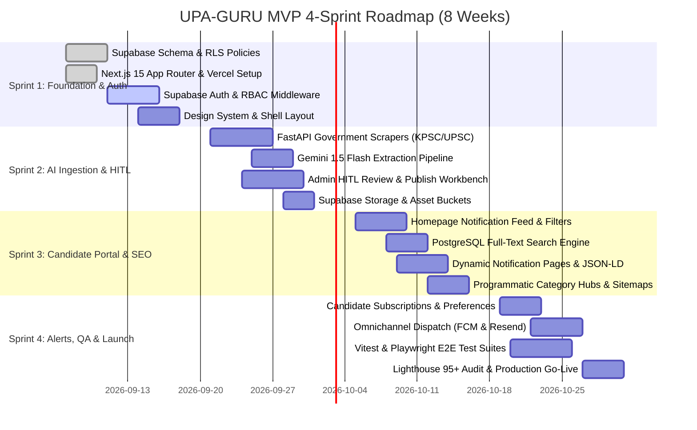

# UPA-GURU MVP Sprint Plan (4 Sprints / 8 Weeks)

## Executive Overview

- **Sprint Cadence**: 2 Weeks per Sprint (10 working days / sprint)
- **Total Duration**: 8 Weeks to Production MVP Launch
- **Source Backlog**: [task-backlog.json](file:///d:/Prajna%20Development/Dev%20Projects/upaguru/.agents/task-backlog.json) (v3.0.0, 75 Tasks, 132 Subtasks)
- **MVP Scope Authority**: [mvp-scope.md](file:///d:/Prajna%20Development/Dev%20Projects/upaguru/.agents/knowledge/mvp/mvp-scope.md) (Listing, Detail Pages, Full-Text Search, Category Filters, User Auth, Alerts, Admin HITL, Dynamic SEO, Lighthouse >= 95)
- **Development Workflow Reference**: [development-workflow.md](file:///d:/Prajna%20Development/Dev%20Projects/upaguru/.agents/knowledge/workflows/development-workflow.md)



---

## Sprint 1: Foundation, Database & Authentication Platform

- **Duration**: Weeks 1 – 2
- **Priority Profile**: 16 P0 (Critical), 2 P1 (High) | Total Tasks: 18
- **Primary Agents**: Solution Architect, DevOps Engineer, Frontend Engineer, UI/UX Designer, Backend Engineer

### Goal
Establish the foundational infrastructure: execute the PostgreSQL schema with Row-Level Security (RLS) on Supabase, configure Next.js 15 App Router deployment on Vercel, implement user authentication with strict Role-Based Access Control (RBAC), provision Redis rate limiting, and establish the mobile-first design tokens and root application shell.

### Sprint 1 Tasks

| Task ID | Title | Priority | Effort | Assigned Agent | Dependencies |
| :--- | :--- | :---: | :---: | :--- | :--- |
| `TASK-01010101` | Create Enum Types (`exam_category_enum`, `notification_status_enum`, `draft_status_enum`) | P0 | 1 hr | Solution Architect | None |
| `TASK-01010102` | Create Core Tables: `exams`, `notifications`, `draft_notifications`, `user_subscriptions`, `audit_logs` | P0 | 4 hrs | Solution Architect | `TASK-01010101` |
| `TASK-01010103` | Create Performance Indexes on `notifications`, `exams`, `draft_notifications` | P0 | 1 hr | Solution Architect | `TASK-01010102` |
| `TASK-01010201` | Enable RLS on All 5 Public Tables | P0 | 30 mins | Solution Architect | `TASK-01010102` |
| `TASK-01010202` | Create Public Read Policies for Candidate Access | P0 | 1 hr | Solution Architect | `TASK-01010201` |
| `TASK-01010203` | Create Admin Full Access & User Self-Service RLS Policies | P0 | 1 hr | Solution Architect | `TASK-01010201` |
| `TASK-01020101` | Configure Supabase Auth Providers (Email OTP & Google OAuth) | P0 | 2 hrs | DevOps Engineer | None |
| `TASK-01020102` | Build Supabase Auth Client Wrappers (Browser, Server, Middleware) | P0 | 4 hrs | Frontend Engineer | `TASK-01020101` |
| `TASK-01020103` | Build Auth UI Pages (Login, Register, Forgot Password, Callback) | P0 | 6 hrs | Frontend Engineer | `TASK-01020102` |
| `TASK-01020201` | Create PL/pgSQL Function & Trigger for Default Role Assignment (`app_role = candidate`) | P0 | 3 hrs | Solution Architect | `TASK-01010201` |
| `TASK-01020202` | Build Next.js Middleware for Role-Based Route Protection (`/admin/*`) | P0 | 4 hrs | Frontend Engineer | `TASK-01020102`, `TASK-01020201` |
| `TASK-01030101` | Initialize Next.js 15 App Router Project with TypeScript Strict Mode | P0 | 2 hrs | DevOps Engineer | None |
| `TASK-01030102` | Connect GitHub Repository to Vercel & Configure Environment Variables | P0 | 1 hr | DevOps Engineer | `TASK-01030101` |
| `TASK-01030103` | Configure OWASP Security Headers in `next.config.js` | P0 | 2 hrs | DevOps Engineer | `TASK-01030101` |
| `TASK-01040101` | Provision Upstash Redis Instance & Store Credentials | P1 | 1 hr | DevOps Engineer | None |
| `TASK-01040102` | Implement Sliding Window Rate Limiter Using `@upstash/ratelimit` | P1 | 3 hrs | Backend Engineer | `TASK-01040101` |
| `TASK-02010101` | Create Global Design System (`globals.css`) with Color Palette & Typography Tokens | P0 | 4 hrs | UI/UX Designer | None |
| `TASK-02010102` | Build Root Layout (`app/layout.tsx`) with Header & Footer Components | P0 | 4 hrs | Frontend Engineer | `TASK-02010101` |

### Deliverables
1. **Database Foundation**: 5 core PostgreSQL tables migrated on Supabase with foreign keys, composite indexes, and strict RLS policies blocking unauthorized access.
2. **Authentication Flow**: Working Candidate & Admin Sign Up, Login, and Password Reset flows with session cookies and auto-assigned `candidate` role.
3. **RBAC Guard**: Next.js Edge Middleware redirecting unauthenticated or non-admin users attempting to access `/admin/*`.
4. **App Scaffold & Design Tokens**: Production Vercel deployment with Next.js 15 App Router, OWASP security headers, Upstash Redis rate limiter, responsive Header/Footer, and Tailwind CSS design tokens.

---

## Sprint 2: AI Ingestion Engine & Admin HITL Workbench

- **Duration**: Weeks 3 – 4
- **Priority Profile**: 13 P0 (Critical), 6 P1 (High) | Total Tasks: 19
- **Primary Agents**: Backend Engineer, Frontend Engineer, DevOps Engineer

### Goal
Build the automated notification ingestion engine (FastAPI web scrapers + Gemini 1.5 Flash structured entity extraction) and deliver the Human-In-The-Loop (HITL) Admin verification workbench. Enable admins to review AI-extracted draft notifications against original PDF notices, edit fields, and publish or reject them with audit logging.

### Sprint 2 Tasks

| Task ID | Title | Priority | Effort | Assigned Agent | Dependencies |
| :--- | :--- | :---: | :---: | :--- | :--- |
| `TASK-04010101` | Initialize FastAPI Scraper Project Structure with Poetry | P0 | 3 hrs | Backend Engineer | None |
| `TASK-04010102` | Build KPSC Crawler Module (`crawlers/kpsc.py`) with Playwright Headless | P0 | 1.5 days | Backend Engineer | `TASK-04010101` |
| `TASK-04010103` | Build UPSC, SSC, RRB Crawler Modules | P0 | 3 days | Backend Engineer | `TASK-04010102` |
| `TASK-04010104` | Implement Redis Deduplication & APScheduler Cron Jobs | P0 | 4 hrs | Backend Engineer | `TASK-04010102` |
| `TASK-04020101` | Define Pydantic Extraction Output Schema (`ExamNotificationExtraction`) | P0 | 2 hrs | Backend Engineer | None |
| `TASK-04020102` | Build Gemini Extraction Function with Structured Outputs (`gemini-1.5-flash`) | P0 | 4 hrs | Backend Engineer | `TASK-04020101` |
| `TASK-04020103` | Build Draft Insertion Pipeline (Extraction → Supabase `draft_notifications`) | P0 | 3 hrs | Backend Engineer | `TASK-04020102` |
| `TASK-06010101` | Create Supabase Storage Buckets (`notifications-pdf`, `exam-logos`) | P1 | 2 hrs | DevOps Engineer | None |
| `TASK-06010102` | Build File Upload Utility with MIME Validation & 25MB Size Limits | P1 | 3 hrs | Backend Engineer | `TASK-06010101` |
| `TASK-03010101` | Create Admin Layout (`app/admin/layout.tsx`) with Sidebar Navigation | P0 | 4 hrs | Frontend Engineer | `TASK-01020202` |
| `TASK-03010102` | Build Admin Dashboard Stats Overview Page (`app/admin/page.tsx`) | P0 | 3 hrs | Frontend Engineer | `TASK-03010101` |
| `TASK-03020101` | Create `getDraftNotifications()` Data Access Function with Filters | P0 | 2 hrs | Frontend Engineer | `TASK-01010102` |
| `TASK-03020102` | Build Draft Queue Page (`app/admin/drafts/page.tsx`) with Status Badges | P0 | 4 hrs | Frontend Engineer | `TASK-03020101` |
| `TASK-03020103` | Build Draft Review Page (`app/admin/drafts/[id]/page.tsx`) with Side-by-Side PDF Previewer | P0 | 6 hrs | Frontend Engineer | `TASK-03020102` |
| `TASK-03020104` | Create `publishNotificationAction` & `rejectDraftAction` Server Actions with Audit Logging | P0 | 4 hrs | Frontend Engineer | `TASK-01010102` |
| `TASK-03030101` | Build Exam CRUD Pages (`app/admin/exams`) | P1 | 5 hrs | Frontend Engineer | `TASK-03010101` |
| `TASK-03030102` | Build Notification CRUD Pages (`app/admin/notifications`) for Manual Data Entry | P1 | 4 hrs | Frontend Engineer | `TASK-03030101` |
| `TASK-03040101` | Build Audit Log Viewer Page (`app/admin/audit-logs/page.tsx`) | P1 | 5 hrs | Frontend Engineer | `TASK-03010101` |
| `TASK-06020101` | Add Cache Tags and Revalidation (`revalidateTag`) to All Mutation Actions | P1 | 3 hrs | Frontend Engineer | `TASK-03020104` |

### Deliverables
1. **Automated Crawler Service**: Python FastAPI service running headless Playwright crawlers for KPSC, UPSC, SSC, and RRB with SHA-256 PDF deduplication via Upstash Redis.
2. **AI Extraction Pipeline**: Gemini 1.5 Flash structured parser converting PDF notices into validated JSON and writing to `draft_notifications`.
3. **Asset Storage**: Supabase Storage buckets configured for official PDF attachments and exam logos.
4. **Admin HITL Review Suite**: Two-column review UI displaying PDF alongside editable notification fields; single-click approval promoting drafts into `notifications` and logging to `audit_logs`.
5. **Manual Management**: Admin CRUD interfaces for creating, editing, and managing exams and notifications directly.

---

## Sprint 3: Candidate Portal, Search & SEO Engine (Core MVP UX)

- **Duration**: Weeks 5 – 6
- **Priority Profile**: 11 P0 (Critical), 7 P1 (High) | Total Tasks: 18
- **Primary Agents**: Frontend Engineer, Solution Architect, SEO Engineer, DevOps Engineer, Backend Engineer

### Goal
Deliver the high-converting public candidate portal: the paginated notification homepage feed, instant category and state filtering, fast PostgreSQL GIN full-text search, responsive `/notification/[slug]` detail pages with Google-compliant `JobPosting` and `Event` JSON-LD structured data, programmatic SEO landing pages, and ISR caching targeting Lighthouse scores >= 95.

### Sprint 3 Tasks

| Task ID | Title | Priority | Effort | Assigned Agent | Dependencies |
| :--- | :--- | :---: | :---: | :--- | :--- |
| `TASK-02020101` | Create Supabase Data Access Function: `getPublishedNotifications()` | P0 | 3 hrs | Frontend Engineer | `TASK-01010102` |
| `TASK-02020102` | Build `NotificationCard` Server Component with Status Badges & Deadline Counters | P0 | 3 hrs | Frontend Engineer | None |
| `TASK-02020103` | Build Interactive Filter Bar Client Component (Category, State, Status) | P0 | 4 hrs | Frontend Engineer | None |
| `TASK-02020104` | Build Paginated Homepage Component (`app/(portal)/page.tsx`) | P0 | 4 hrs | Frontend Engineer | `TASK-02020101`, `TASK-02020102`, `TASK-02020103` |
| `TASK-02030101` | Create `getNotificationBySlug()` Data Access Function with Exam Join | P0 | 1 hr | Frontend Engineer | `TASK-02020101` |
| `TASK-02030102` | Build Notification Detail Page (`app/notification/[slug]/page.tsx`) with Key Dates & Vacancy Grid | P0 | 6 hrs | Frontend Engineer | `TASK-02030101` |
| `TASK-02030103` | Implement `generateMetadata()` & JSON-LD Structured Data (`JobPosting` / `Event`) | P0 | 4 hrs | SEO Engineer | `TASK-02030101` |
| `TASK-02030104` | Implement `generateStaticParams()` for ISR Pre-rendering Top 50 Notifications | P1 | 1 hr | Frontend Engineer | `TASK-02030102` |
| `TASK-02040101` | Create PostgreSQL GIN Index on `notifications` for Full-Text Search | P0 | 2 hrs | Solution Architect | `TASK-01010102` |
| `TASK-02040102` | Build `SearchBar` Client Component with 300ms Debounce & URL Sync | P0 | 3 hrs | Frontend Engineer | None |
| `TASK-02040103` | Build Search Results Page (`app/search/page.tsx`) with Highlighted Query Matches | P0 | 3 hrs | Frontend Engineer | `TASK-02040101`, `TASK-02040102` |
| `TASK-02050101` | Build `/category/[category]` Programmatic SEO Route | P1 | 4 hrs | Frontend Engineer | `TASK-02020101` |
| `TASK-02050102` | Build `/state/[state]` Programmatic SEO Route | P1 | 3 hrs | Frontend Engineer | `TASK-02020101` |
| `TASK-02050103` | Build `/exam/[slug]` Programmatic SEO Route | P1 | 3 hrs | Frontend Engineer | `TASK-02020101` |
| `TASK-02050104` | Build Dynamic XML Sitemap (`app/sitemap.ts`) & `robots.txt` | P1 | 3 hrs | SEO Engineer | `TASK-02050101`, `TASK-02050102`, `TASK-02050103` |
| `TASK-07010101` | Install & Configure Sentry SDK for Next.js App Router | P1 | 3 hrs | DevOps Engineer | None |
| `TASK-07010102` | Install & Configure Sentry SDK for Python Scraper Pipeline | P1 | 1 hr | Backend Engineer | None |
| `TASK-09030102` | Document Rich Results Validation Procedure & Google Search Console Submission | P0 | 2 hrs | SEO Engineer | `TASK-02030103` |

### Deliverables
1. **Candidate Feed & Homepage**: Responsive homepage rendering active government notifications with category pill filters, status badges (e.g., *Application Open*, *Admit Card Out*), and URL-driven pagination.
2. **Notification Detail Experience**: Comprehensive detail page showing eligibility criteria, key dates timeline, vacancy tables, direct apply button, and official PDF download.
3. **Full-Text Search Engine**: Sub-100ms debounced search bar powered by PostgreSQL GIN `to_tsvector` indexing.
4. **Programmatic SEO Engine**: Programmatic landing pages for categories, states, and specific exams with dynamic `sitemap.xml`, canonical links, and validated `JobPosting` schema markup for Google Search Jobs.
5. **ISR & Error Monitoring**: Edge-cached static pages with on-demand ISR revalidation and active Sentry error monitoring.

---

## Sprint 4: Omnichannel Alerts, Hardening, QA & Launch Readiness

- **Duration**: Weeks 7 – 8
- **Priority Profile**: 6 P0 (Critical), 10 P1 (High), 4 P2 (Medium) | Total Tasks: 20
- **Primary Agents**: QA Engineer, Backend Engineer, Frontend Engineer, DevOps Engineer, SEO Engineer

### Goal
Implement candidate alert preferences and automated notification delivery (FCM Web Push, Resend Email alerts, and Telegram bots), expose public REST API endpoints with OpenAPI documentation, execute end-to-end regression test suites, enforce OWASP security compliance, and achieve Lighthouse mobile scores >= 95 for launch readiness.

### Sprint 4 Tasks

| Task ID | Title | Priority | Effort | Assigned Agent | Dependencies |
| :--- | :--- | :---: | :---: | :--- | :--- |
| `TASK-05010101` | Build Subscription Preference Page (`app/preferences/page.tsx`) | P1 | 6 hrs | Frontend Engineer | `TASK-01020102` |
| `TASK-05020101` | Configure Firebase Project & Service Worker (`public/firebase-messaging-sw.js`) | P1 | 3 hrs | Backend Engineer | None |
| `TASK-05020102` | Build FCM Push Dispatch Function (`lib/push/fcm.ts`) with Token Validation | P1 | 3 hrs | Backend Engineer | `TASK-05020101` |
| `TASK-05030101` | Create Telegram Bot & Webhook Handler (`app/api/telegram/webhook/route.ts`) | P1 | 4 hrs | Backend Engineer | None |
| `TASK-05030102` | Build Telegram Broadcast Dispatch Function (`lib/push/telegram.ts`) | P1 | 3 hrs | Backend Engineer | `TASK-05030101` |
| `TASK-05040101` | Build WhatsApp Business API Dispatch (`lib/push/whatsapp.ts`) | P2 | 4 hrs | Backend Engineer | None |
| `TASK-05040102` | Build Email Digest & Alert Dispatch Function via Resend (`lib/push/email.ts`) | P2 | 4 hrs | Backend Engineer | None |
| `TASK-05050101` | Build Notification Published Webhook Handler (`app/api/webhooks/notification-published`) | P1 | 4 hrs | Backend Engineer | `TASK-03020104` |
| `TASK-05050102` | Build Omnichannel Dispatch Orchestrator Function across Channels | P1 | 4 hrs | Backend Engineer | `TASK-05050101`, `TASK-05020102`, `TASK-05030102` |
| `TASK-08010101` | Build `GET /api/v1/notifications` Route Handler with Filtering & Pagination | P1 | 4 hrs | Backend Engineer | `TASK-02020101`, `TASK-01040102` |
| `TASK-08010102` | Build `GET /api/v1/exams` and `GET /api/v1/search` Route Handlers | P1 | 4 hrs | Backend Engineer | `TASK-08010101` |
| `TASK-08020101` | Write OpenAPI 3.0 Specification and Host Interactive Swagger Docs (`/docs`) | P2 | 4 hrs | Backend Engineer | `TASK-08010102` |
| `TASK-07020101` | Integrate GA4 and Privacy-Friendly PostHog Analytics Scripts | P2 | 4 hrs | Frontend Engineer | None |
| `TASK-07030101` | Create Healthchecks.io Monitors & Integrate Crawler Heartbeat Pings | P1 | 3 hrs | DevOps Engineer | None |
| `TASK-09010101` | Configure Vitest with Next.js 15 & TypeScript Support | P0 | 2 hrs | QA Engineer | None |
| `TASK-09010102` | Write Unit Tests for Zod Validation Schemas (`notificationSchema`, `examSchema`) | P0 | 4 hrs | QA Engineer | `TASK-09010101` |
| `TASK-09010103` | Write Unit Tests for JSON-LD Schema Generators (`JobPosting`, `Event`) | P0 | 3 hrs | QA Engineer | `TASK-09010101` |
| `TASK-09020101` | Configure Playwright & Write Candidate Journey E2E Tests (Search, Browse, Filter) | P0 | 5 hrs | QA Engineer | None |
| `TASK-09020102` | Write Admin HITL Flow E2E Tests (Login, Review Draft, Approve, Publish) | P0 | 5 hrs | QA Engineer | `TASK-09020101` |
| `TASK-09030101` | Configure Lighthouse CI with Mobile Score Assertions (Performance >= 95, SEO >= 95) | P0 | 3 hrs | QA Engineer | None |

### Deliverables
1. **Candidate Alert Engine**: Granular user notification preferences by category/exam; instant alerts sent on admin publish via FCM Web Push, Resend Email, and Telegram bot.
2. **Public REST API**: Versioned `/api/v1` endpoints for notifications, exams, and search protected by Upstash Redis rate limiting, with live Swagger documentation.
3. **Automated Test Coverage**: Vitest unit test suite validating Zod schemas and JSON-LD generators; Playwright E2E suites verifying candidate journeys and admin HITL workflows.
4. **Lighthouse CI & Performance Sign-Off**: Automated CI check verifying Core Web Vitals, Mobile Performance >= 95, and SEO score >= 95.
5. **Observability & Launch Readiness**: Uptime heartbeat monitoring, Sentry production error tracking, and production sign-off.

---

## Resource & Agent Allocation Across Sprints

```
Sprint 1: Architect (7) | DevOps (5) | Frontend (4) | Backend (1) | UI/UX (1)
Sprint 2: Backend (8)   | Frontend (10) | DevOps (1)
Sprint 3: Frontend (12) | SEO (3)    | Architect (1) | DevOps (1) | Backend (1)
Sprint 4: QA (6)        | Backend (11)  | Frontend (2)  | DevOps (1)
```

| Agent Role | Sprint 1 | Sprint 2 | Sprint 3 | Sprint 4 | Total Tasks |
| :--- | :---: | :---: | :---: | :---: | :---: |
| **Solution Architect** | 7 | 0 | 1 | 0 | **8** |
| **DevOps Engineer** | 5 | 1 | 1 | 1 | **8** |
| **Frontend Engineer** | 4 | 10 | 12 | 2 | **28** |
| **Backend Engineer** | 1 | 8 | 1 | 11 | **21** |
| **UI/UX Designer** | 1 | 0 | 0 | 0 | **1** |
| **SEO Engineer** | 0 | 0 | 3 | 0 | **3** |
| **QA Engineer** | 0 | 0 | 0 | 6 | **6** |
| **Total Tasks per Sprint** | **18** | **19** | **18** | **20** | **75** |

---

## MVP Milestones & Definition of Done (DoD)

1. **Milestone 1 (End of Week 2)**: Database tables & RLS live on Supabase, Candidate & Admin Auth working, Next.js 15 preview deployment on Vercel.
2. **Milestone 2 (End of Week 4)**: Automated government scrapers extracting notices via Gemini 1.5 Flash into Admin queue; Admin can review PDF, edit, approve, and publish.
3. **Milestone 3 (End of Week 6)**: Candidate homepage feed, category filters, full-text search, and `/notification/[slug]` live with validated Google `JobPosting` schema tags and ISR caching.
4. **Milestone 4 (End of Week 8)**: Candidate push/email alerts delivering on publish, REST API documented, Vitest + Playwright tests passing in CI, mobile Lighthouse score >= 95, and production MVP launched.
