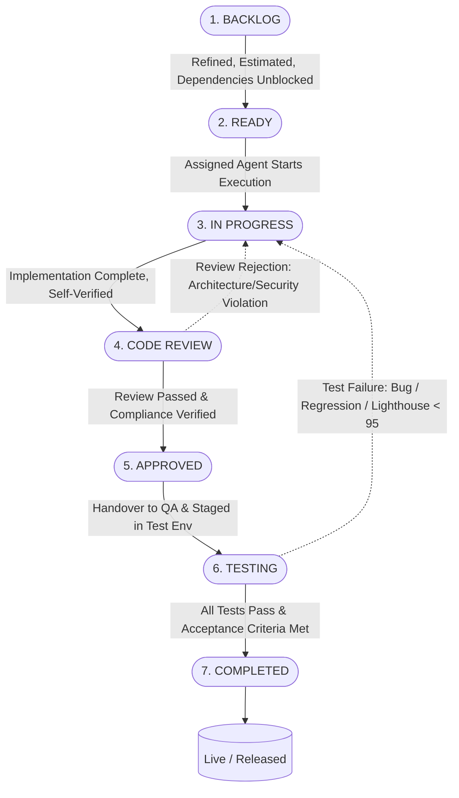

# UPA-GURU Task Lifecycle Execution Workflow

## Overview
This document defines the formal operational state machine governing task execution across the UPA-GURU project. Every work item tracked in [task-backlog.json](file:///d:/Prajna%20Development/Dev%20Projects/upaguru/.agents/task-backlog.json)—from Epics down to atomic Subtasks—must strictly progress through these 7 deterministic lifecycle states to ensure architecture compliance, zero security vulnerabilities, test-verified code quality, and strict traceability.

---

## State Machine Pipeline

---

## State Definitions & Gate Protocols

### 1. BACKLOG
* **Backlog Status Identifier**: `"status": "Backlog"` (or `"Pending"`)
* **Definition**: The item is logged in the project backlog but is not yet ready for immediate sprint consumption. It represents raw scope, requested capabilities, or unrefined technical requirements.
* **Responsible Agent**: **Product Manager** (with input from **Solution Architect**)
* **Entry Criteria**:
  - Item is categorized under an Epic and Feature hierarchy (`EPIC` → `FEATURE` → `USER STORY` → `TASK` → `SUBTASK`).
  - Item has a unique ID (e.g., `TASK-01020102`).
  - High-level business intent or engineering objective is identified.
* **Activities**:
  - Requirements clarification, stakeholder alignment, and feature scoping.
  - Identification of upstream architectural dependencies (ADRs, database schema changes, external APIs).
  - Preliminary priority assignment (`P0`, `P1`, `P2`, `P3`).
* **Exit Gate / Definition of Ready (DoR)**:
  - [ ] Unambiguous **Title** and **Description** documented.
  - [ ] Specific, testable **Acceptance Criteria** defined.
  - [ ] Priority level assigned.
  - [ ] Upstream dependencies explicitly enumerated in `dependencies: []`.
  - [ ] Assigned agent designated based on capability domain.
  - [ ] Estimated effort in hours/days specified.
* **Next State**: `READY`

---

### 2. READY
* **Backlog Status Identifier**: `"status": "Ready"`
* **Definition**: The task is fully groomed, unblocked, and available in the current Sprint backlog for immediate pickup by the assigned agent.
* **Responsible Agent**: **Assigned Implementing Agent** (Frontend, Backend, DevOps, UI/UX, or Solution Architect)
* **Entry Criteria**:
  - Passes all Backlog Definition of Ready (DoR) criteria.
  - **Prerequisite Dependencies**: All items listed in the `dependencies` array have reached `COMPLETED` status.
  - **Required Architecture Artifacts**: Pertinent ADRs in [decisions/](file:///d:/Prajna%20Development/Dev%20Projects/upaguru/.agents/knowledge/architecture/decisions/), DB migrations in `schema-v1.sql`, or UI specs exist and are approved.
* **Activities**:
  - Agent claims task and initializes execution notes using [task-execution-template.md](file:///d:/Prajna%20Development/Dev%20Projects/upaguru/.agents/task-execution-template.md).
  - Validates development environment, secrets, and toolchain prerequisites.
* **Exit Gate**:
  - [ ] Agent confirms understanding of requirements and acceptance criteria.
  - [ ] Branch or working context established.
* **Next State**: `IN PROGRESS`

---

### 3. IN PROGRESS
* **Backlog Status Identifier**: `"status": "In Progress"`
* **Definition**: Active code generation, configuration, design, or infrastructure provisioning is actively being executed by the assigned agent.
* **Responsible Agent**: **Assigned Implementing Agent**
* **Execution Guardrails (Strict Enforcement)**:
  - **Task-Scoped Scope**: Write code strictly for the assigned task ID. Never refactor or touch unrelated project files.
  - **Architecture Compliance**: Adhere strictly to Next.js 15 App Router, React Server Components (RSC), TypeScript strict mode (no `any`), and Zod input validation.
  - **No Hardcoded Secrets**: Use only `process.env` / `.env.local` for credentials, API tokens, and service roles.
  - **Database & Security**: Every PostgreSQL table must have Row-Level Security (RLS) enabled with explicit policies.
  - **No Symptom Masking**: Never wrap code in empty `try/catch` blocks or disable ESLint rules.
* **Activities**:
  - Implement logic, schemas, UI components, API endpoints, or crawler modules.
  - Add inline documentation and TSDoc/docstrings detailing intent, inputs, and outputs.
  - Conduct agent self-review and local static verification (TypeScript compiler check, lint check).
* **Exit Gate**:
  - [ ] Code implementation completely addresses the task objective.
  - [ ] Zero TypeScript errors (`tsc --noEmit` clean).
  - [ ] Zero ESLint warnings or errors.
  - [ ] Self-verification steps executed and logged.
* **Next State**: `CODE REVIEW`

---

### 4. CODE REVIEW
* **Backlog Status Identifier**: `"status": "Code Review"`
* **Definition**: The code or configuration has been submitted for peer and architectural inspection to verify structural integrity, security guardrails, and styling fidelity.
* **Responsible Agent**: **Peer Engineering Agent** / **Solution Architect** / **Tech Lead**
* **Review Checklist**:
  - [ ] **Architecture Check**: Follows Next.js 15 App Router conventions (server vs. client components separation, server actions for mutations).
  - [ ] **Security Review**:
    - Supabase RLS policies properly applied on new tables/queries.
    - Role-Based Access Control (RBAC) enforced on protected endpoints/routes.
    - Upstash Redis rate limiting applied on public mutation endpoints.
    - No secret leakage in client-side bundles.
  - [ ] **Data Validation**: Inputs validated with strict Zod schemas before processing.
  - [ ] **Audit Trail**: Administrative actions logged to `audit_logs` table.
  - [ ] **Performance & Caching**: Cache tags and `revalidateTag` / `revalidatePath` implemented for on-demand ISR.
* **Review Outcomes**:
  - **Rejected (Rework Required)**: Violations, security risks, or code smell detected. State returns to `IN PROGRESS` with detailed actionable review feedback.
  - **Approved**: All checklist items confirmed. State advances to `APPROVED`.
* **Next State**: `APPROVED` (or `IN PROGRESS` upon rejection)

---

### 5. APPROVED
* **Backlog Status Identifier**: `"status": "Approved"`
* **Definition**: The code has passed code review and architectural evaluation. It is merged into the integration branch and queued for quality assurance and automated test execution.
* **Responsible Agent**: **QA Engineer** (Receiving Agent)
* **Entry Criteria**:
  - Formal review approval signed off.
  - Pull request / integration commit ready for build and test staging.
* **Activities**:
  - QA Engineer provisions test fixtures, seed data, and mocks.
  - Test environment initialized.
* **Exit Gate**:
  - [ ] Build and compilation succeed cleanly without warnings.
  - [ ] Test harness and test database container ready.
* **Next State**: `TESTING`

---

### 6. TESTING
* **Backlog Status Identifier**: `"status": "Testing"`
* **Definition**: Comprehensive verification and testing phase including unit tests, integration tests, Playwright end-to-end (E2E) flows, and SEO/performance audits.
* **Responsible Agent**: **QA Engineer** (collaborating with **SEO Engineer**)
* **Testing Activities**:
  1. **Unit & Contract Testing (Vitest)**:
     - Verify Zod schema validation edge cases.
     - Validate JSON-LD structured data generators (`JobPosting`, `Event`).
     - Test database helper functions and parsing utilities.
  2. **End-to-End Testing (Playwright)**:
     - Execute Candidate Journey E2E tests (Homepage feed, search bar debounce, category filtering, notification slug detail view).
     - Execute Admin HITL Journey E2E tests (Admin login, draft inspection, PDF viewer rendering, one-click approve/publish, audit log entry).
  3. **Lighthouse CI & Performance Audit**:
     - Mobile Performance score $\ge 95$.
     - SEO score $\ge 95$.
     - Cumulative Layout Shift (CLS) $< 0.1$, Largest Contentful Paint (LCP) $< 2.5s$.
  4. **Acceptance Criteria Verification**:
     - Step-by-step verification of every acceptance criterion listed in `task-backlog.json`.
* **Testing Outcomes**:
  - **Failed (Defect Logged)**: Failing assertions, broken layouts, regressions, or Lighthouse $< 95$. Task transitions back to `IN PROGRESS` with reproducible failure logs and Playwright trace artifacts.
  - **Passed**: All tests succeed with 100% assertions green.
* **Exit Gate**:
  - [ ] 100% of Task Acceptance Criteria verified and validated.
  - [ ] Vitest test suite passes with zero failures.
  - [ ] Playwright E2E suite passes in headless mode.
  - [ ] Lighthouse CI mobile performance and SEO target $\ge 95$ achieved.
* **Next State**: `COMPLETED` (or `IN PROGRESS` upon test failure)

---

### 7. COMPLETED
* **Backlog Status Identifier**: `"status": "Completed"`
* **Definition**: The task is formally finished, verified, documented, and released into the target release branch/environment.
* **Responsible Agent**: **Assigned Implementing Agent** & **DevOps Engineer**
* **Definition of Done (DoD) Checklist**:
  - [ ] **Implementation**: Code delivered strictly matching scope, following all architecture rules.
  - [ ] **Quality Assurance**: Automated tests passing, manual verification checklist signed off.
  - [ ] **Documentation**:
    - Relevant `.agents/knowledge/` documentation updated if schemas, contracts, or architecture evolved.
    - Docstrings and comments present in all modified files.
  - [ ] **Backlog Sync**: Task status updated to `"Completed"` in [task-backlog.json](file:///d:/Prajna%20Development/Dev%20Projects/upaguru/.agents/task-backlog.json).
  - [ ] **Deployment**: Integrated cleanly into production CI/CD pipeline.

---

## State Transition Matrix & Agent Responsibility

| From State | To State | Trigger / Condition | Actor / Agent | Action Required |
| :--- | :--- | :--- | :--- | :--- |
| **BACKLOG** | **READY** | Grooming complete, DoR satisfied, dependencies met | Product Manager / Architect | Update status to `Ready` |
| **READY** | **IN PROGRESS** | Task claimed for active sprint execution | Implementing Agent | Update status to `In Progress` |
| **IN PROGRESS** | **CODE REVIEW** | Code written, typed, linted, self-verified | Implementing Agent | Open review request, set to `Code Review` |
| **CODE REVIEW** | **IN PROGRESS** | Architecture, security, or quality defects found | Reviewer / Architect | Log rejection notes, return to `In Progress` |
| **CODE REVIEW** | **APPROVED** | Review checklist 100% passed | Reviewer / Architect | Approve and set status to `Approved` |
| **APPROVED** | **TESTING** | Code staged in test environment | QA Engineer | Initialize test suite, set to `Testing` |
| **TESTING** | **IN PROGRESS** | Test assertion failure, bug, or Lighthouse $< 95$ | QA Engineer / SEO | Attach failure trace, return to `In Progress` |
| **TESTING** | **COMPLETED** | All AC verified, tests pass, DoD satisfied | QA / DevOps / Lead | Mark task `"status": "Completed"` in backlog |

---

## Exception Handling & Fast-Track Rules

### 1. Blocked Tasks
If a task in `IN PROGRESS` encounters an unforeseen dependency or technical impediment:
1. The agent immediately flags the task as `BLOCKED`.
2. The blocking reason is appended to the task's execution notes.
3. The Product Manager and Solution Architect are alerted to triage the blocker.
4. The task remains paused without masking errors or bypassing constraints.

### 2. P0 Critical Hotfixes
For critical production security patches or P0 defect resolutions:
1. Product Manager generates an expedited P0 task in `READY` status.
2. Code review and security inspection are prioritized immediately.
3. Full automated testing suite must still be executed—no bypass of QA or RLS checks is permitted under any circumstance.
